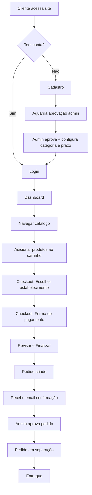

# PRD - Levee B2B | Aplicativo Web de Delivery Hortifruti

**Versão:** 1.0
**Data:** 26 de janeiro de 2026
**Status:** Aprovado para Desenvolvimento
**Fornecedor:** Levee Hortiplus

---

## 📋 Sumário Executivo

### Visão Geral
O **Levee B2B** é uma plataforma web de e-commerce B2B para venda de produtos hortifruti da **Levee Hortiplus** para estabelecimentos comerciais (padarias, restaurantes, escolas, academias) em Belo Horizonte e região metropolitana.

### Proposta de Valor
- **Para o Cliente B2B**: Comprar hortifruti de qualidade com prazo de pagamento, preços competitivos baseados no volume/categoria, gestão simplificada de múltiplos pontos de entrega
- **Para Levee Hortiplus**: Digitalizar vendas B2B, reduzir dependência do WhatsApp, aumentar ticket médio, melhorar controle de estoque e financeiro

### Diferencial Competitivo
1. **Precificação Inteligente**: Sistema de categorias (Bronze/Prata/Ouro) com preços diferenciados
2. **Flexibilidade de Pagamento**: Prazo configurável (7, 14 ou 21 dias) sem burocracia
3. **Multi-estabelecimentos**: Cliente com várias lojas gerencia tudo em uma conta
4. **Simplicidade**: Interface focada, sem funcionalidades desnecessárias

### Objetivos de Negócio (Primeiros 3 meses)
- **GMV**: R$ 100.000/mês
- **Clientes ativos**: 30 estabelecimentos
- **Frequência de pedidos**: 2-3x por semana por cliente
- **NPS**: > 60
- **Taxa de inadimplência**: < 5%

---

## 🎯 Análise de Mercado e Personas

### Mercado-Alvo
**Segmento**: Food service B2B em Belo Horizonte
**Tamanho estimado**: 15.000+ estabelecimentos (padarias, restaurantes, bares, escolas, academias)
**Oportunidade**: R$ 500M/ano em hortifruti B2B na região

### Personas (Baseadas em Pesquisa Etnográfica)

#### Persona 1: Geraldo - O Panificador Tradicional
**Perfil:**
- Homem, 55-65 anos
- Dono de padaria tradicional (2ª geração)
- Região: Venda Nova, Região Leste

**Dores:**
- Fornecedor falha nas entregas aos sábados
- Volatilidade de preços da Ceasa
- Funcionários desperdiçam produtos

**Motivações:**
- Prazo de pagamento (fluxo de caixa apertado)
- Pontualidade na entrega
- Relacionamento de confiança

**Como o Levee B2B resolve:**
- ✅ Prazo de 14-21 dias configurado
- ✅ Histórico de preços para planejamento
- ✅ Entregas pontuais com rastreamento

#### Persona 2: Mariana - A Gestora de Restaurante
**Perfil:**
- Mulher, 30-40 anos
- Dona de restaurante self-service
- Região: Savassi, Lourdes
- Formação superior

**Dores:**
- Falta de tempo para cotar preços
- Volatilidade impacta margem
- Inconsistência de qualidade

**Motivações:**
- Eficiência (one-stop-shop)
- Preço competitivo
- Relatórios para gestão

**Como o Levee B2B resolve:**
- ✅ Catálogo completo, pedido em 5 minutos
- ✅ Preço fixo por categoria
- ✅ Histórico de pedidos para análise

#### Persona 3: Ricardo - O Empreendedor Fit
**Perfil:**
- Homem, 25-35 anos
- Dono de rede de açaí/sucos em academias
- Região: Belvedere, Buritis

**Dores:**
- Maturação da fruta (banana perfeita)
- Logística para múltiplos pontos
- Ruptura de itens chave

**Motivações:**
- Qualidade visual (produto "instagramável")
- Conveniência
- Novidades (frutas exóticas)

**Como o Levee B2B resolve:**
- ✅ Gestão de múltiplos estabelecimentos
- ✅ Pedidos separados por ponto
- ✅ Controle de estoque em tempo real

#### Persona 4: Cláudia - A Administradora Escolar
**Perfil:**
- Mulher, 40-50 anos
- Responsável por compras de escola particular

**Dores:**
- Rastreabilidade (pais perguntam origem)
- Burocracia fiscal
- Protocolo de segurança

**Motivações:**
- Segurança alimentar
- Documentação impecável
- Previsibilidade de custo

**Como o Levee B2B resolve:**
- ✅ Informações de origem dos produtos
- ✅ Notas fiscais corretas
- ✅ Cardápio mensal = pedidos recorrentes

---

## 🏗️ Arquitetura do Produto

### Modelo de Negócio
**Tipo**: E-commerce B2B Próprio (não marketplace)
**Fornecedor**: Levee Hortiplus (único)
**Receitas**:
- Markup sobre preço de custo (20-30% conforme categoria)
- Frete (se aplicável)

**Estrutura de Custos**:
- Custo de mercadoria (COGS)
- Logística e armazenamento
- Tecnologia (hosting, ferramentas)
- Operação (admin, atendimento)

### Stack Técnica

```
┌─────────────────────────────────────────────┐
│           FRONTEND (Next.js 14)             │
│  ┌──────────────────────────────────────┐   │
│  │  UI: React + TailwindCSS + Poppins  │   │
│  │  State: Zustand                      │   │
│  │  Forms: React Hook Form + Zod       │   │
│  └──────────────────────────────────────┘   │
└─────────────────────────────────────────────┘
                    ↓ HTTPS
┌─────────────────────────────────────────────┐
│            BACKEND (Supabase)               │
│  ┌──────────────────────────────────────┐   │
│  │  Database: PostgreSQL + RLS         │   │
│  │  Auth: Supabase Auth (JWT)          │   │
│  │  Storage: Imagens de produtos       │   │
│  │  Edge Functions: Cálculo de preços  │   │
│  └──────────────────────────────────────┘   │
└─────────────────────────────────────────────┘
                    ↓
┌─────────────────────────────────────────────┐
│         WORKFLOWS (N8N)                     │
│  ┌──────────────────────────────────────┐   │
│  │  Email notifications                │   │
│  │  Integração com gateway pagamento   │   │
│  │  Webhooks                           │   │
│  └──────────────────────────────────────┘   │
└─────────────────────────────────────────────┘
                    ↓
┌─────────────────────────────────────────────┐
│         INTEGRATIONS                        │
│  Payment Gateway | Email (SMTP/SendGrid)   │
└─────────────────────────────────────────────┘
```

### Database Schema

```sql
-- USUÁRIOS E AUTENTICAÇÃO
CREATE TABLE users (
  id UUID PRIMARY KEY DEFAULT gen_random_uuid(),
  email VARCHAR(255) UNIQUE NOT NULL,
  role VARCHAR(20) NOT NULL DEFAULT 'customer', -- customer, admin
  cnpj VARCHAR(18) UNIQUE,
  razao_social VARCHAR(255),
  nome_fantasia VARCHAR(255),
  customer_category VARCHAR(10) NOT NULL DEFAULT 'bronze', -- bronze, prata, ouro
  payment_term_days INTEGER NOT NULL DEFAULT 7, -- 7, 14, 21
  is_active BOOLEAN DEFAULT true,
  created_at TIMESTAMP DEFAULT now(),
  updated_at TIMESTAMP DEFAULT now()
);

-- ESTABELECIMENTOS (PONTOS DE ENTREGA)
CREATE TABLE user_establishments (
  id UUID PRIMARY KEY DEFAULT gen_random_uuid(),
  user_id UUID REFERENCES users(id) ON DELETE CASCADE,
  name VARCHAR(255) NOT NULL, -- "Padaria Centro", "Filial Shopping"
  street VARCHAR(255) NOT NULL,
  number VARCHAR(20),
  complement VARCHAR(255),
  neighborhood VARCHAR(100),
  city VARCHAR(100) NOT NULL,
  state VARCHAR(2) NOT NULL,
  zip_code VARCHAR(10) NOT NULL,
  phone VARCHAR(20),
  responsible_name VARCHAR(255), -- Quem recebe a entrega
  is_default BOOLEAN DEFAULT false,
  is_active BOOLEAN DEFAULT true,
  created_at TIMESTAMP DEFAULT now()
);

-- CATEGORIAS DE PRODUTOS
CREATE TABLE categories (
  id UUID PRIMARY KEY DEFAULT gen_random_uuid(),
  name VARCHAR(100) NOT NULL,
  slug VARCHAR(100) UNIQUE NOT NULL,
  icon VARCHAR(50), -- Nome do ícone (ex: "apple", "carrot")
  display_order INTEGER DEFAULT 0,
  is_active BOOLEAN DEFAULT true
);

-- PRODUTOS
CREATE TABLE products (
  id UUID PRIMARY KEY DEFAULT gen_random_uuid(),
  name VARCHAR(255) NOT NULL,
  description TEXT,
  cost_price DECIMAL(10, 2) NOT NULL, -- Preço de custo base
  unit VARCHAR(20) NOT NULL, -- kg, un, maço, cx
  unit_weight DECIMAL(8, 3), -- Peso em kg (se unidade não for kg)
  image_url TEXT,
  stock_quantity DECIMAL(10, 2) DEFAULT 0,
  min_order_quantity DECIMAL(10, 2) DEFAULT 1,
  origin VARCHAR(100), -- Minas Gerais, São Paulo, etc
  is_active BOOLEAN DEFAULT true,
  created_at TIMESTAMP DEFAULT now(),
  updated_at TIMESTAMP DEFAULT now()
);

-- RELACIONAMENTO PRODUTO-CATEGORIA (Many-to-Many)
CREATE TABLE product_categories (
  product_id UUID REFERENCES products(id) ON DELETE CASCADE,
  category_id UUID REFERENCES categories(id) ON DELETE CASCADE,
  PRIMARY KEY (product_id, category_id)
);

-- PEDIDOS
CREATE TABLE orders (
  id UUID PRIMARY KEY DEFAULT gen_random_uuid(),
  order_number VARCHAR(20) UNIQUE NOT NULL, -- LEV-2026-0001
  user_id UUID REFERENCES users(id),
  delivery_establishment_id UUID REFERENCES user_establishments(id),
  subtotal DECIMAL(10, 2) NOT NULL,
  delivery_fee DECIMAL(10, 2) DEFAULT 0,
  discount DECIMAL(10, 2) DEFAULT 0,
  total DECIMAL(10, 2) NOT NULL,
  status VARCHAR(30) NOT NULL DEFAULT 'pending',
    -- pending, confirmed, preparing, delivering, delivered, cancelled
  payment_method VARCHAR(20) NOT NULL, -- pix, boleto
  payment_term_days INTEGER, -- Prazo aplicado neste pedido
  delivery_date DATE,
  notes TEXT,
  created_at TIMESTAMP DEFAULT now(),
  updated_at TIMESTAMP DEFAULT now()
);

-- ITENS DO PEDIDO
CREATE TABLE order_items (
  id UUID PRIMARY KEY DEFAULT gen_random_uuid(),
  order_id UUID REFERENCES orders(id) ON DELETE CASCADE,
  product_id UUID REFERENCES products(id),
  product_name VARCHAR(255) NOT NULL, -- Snapshot do nome
  quantity DECIMAL(10, 2) NOT NULL,
  unit_price DECIMAL(10, 2) NOT NULL, -- Preço praticado
  subtotal DECIMAL(10, 2) NOT NULL,
  created_at TIMESTAMP DEFAULT now()
);

-- PAGAMENTOS
CREATE TABLE payments (
  id UUID PRIMARY KEY DEFAULT gen_random_uuid(),
  order_id UUID REFERENCES orders(id) ON DELETE CASCADE,
  method VARCHAR(20) NOT NULL, -- pix, boleto
  status VARCHAR(20) NOT NULL DEFAULT 'pending',
    -- pending, paid, overdue, cancelled
  amount DECIMAL(10, 2) NOT NULL,
  due_date DATE, -- Data de vencimento (para boleto)
  paid_at TIMESTAMP,
  boleto_url TEXT,
  boleto_barcode TEXT,
  pix_qr_code TEXT,
  pix_qr_code_text TEXT,
  gateway_transaction_id VARCHAR(255),
  created_at TIMESTAMP DEFAULT now(),
  updated_at TIMESTAMP DEFAULT now()
);

-- AUDITORIA DE STATUS DE PEDIDOS
CREATE TABLE order_status_history (
  id UUID PRIMARY KEY DEFAULT gen_random_uuid(),
  order_id UUID REFERENCES orders(id) ON DELETE CASCADE,
  status VARCHAR(30) NOT NULL,
  changed_by UUID REFERENCES users(id),
  notes TEXT,
  created_at TIMESTAMP DEFAULT now()
);
```

---

## 🎨 Sistema de Design

### Design Tokens

#### Cores
```css
/* Primary - Verde (Frescor, Agricultura) */
--color-primary-50: #ECFDF5;
--color-primary-100: #D1FAE5;
--color-primary-200: #A7F3D0;
--color-primary-300: #6EE7B7;
--color-primary-400: #34D399;
--color-primary-500: #10B981; /* Main */
--color-primary-600: #059669;
--color-primary-700: #047857;
--color-primary-800: #065F46;
--color-primary-900: #064E3B;

/* Secondary - Rose (Energia, Destaque) */
--color-secondary-50: #FFF1F2;
--color-secondary-100: #FFE4E6;
--color-secondary-200: #FECDD3;
--color-secondary-300: #FDA4AF;
--color-secondary-400: #FB7185;
--color-secondary-500: #F43F5E; /* Main */
--color-secondary-600: #E11D48;
--color-secondary-700: #BE123C;
--color-secondary-800: #9F1239;
--color-secondary-900: #881337;

/* Categorias de Clientes */
--color-bronze: #CD7F32;
--color-prata: #C0C0C0;
--color-ouro: #FFD700;

/* Neutral */
--color-gray-50: #F9FAFB;
--color-gray-100: #F3F4F6;
--color-gray-200: #E5E7EB;
--color-gray-300: #D1D5DB;
--color-gray-400: #9CA3AF;
--color-gray-500: #6B7280;
--color-gray-600: #4B5563;
--color-gray-700: #374151;
--color-gray-800: #1F2937;
--color-gray-900: #111827;

/* Semantic */
--color-success: #10B981;
--color-warning: #F59E0B;
--color-error: #EF4444;
--color-info: #3B82F6;
```

#### Tipografia
```css
/* Font Family */
font-family: 'Poppins', -apple-system, BlinkMacSystemFont, 'Segoe UI', sans-serif;

/* Font Sizes */
--text-xs: 0.75rem;    /* 12px */
--text-sm: 0.875rem;   /* 14px */
--text-base: 1rem;     /* 16px */
--text-lg: 1.125rem;   /* 18px */
--text-xl: 1.25rem;    /* 20px */
--text-2xl: 1.5rem;    /* 24px */
--text-3xl: 1.875rem;  /* 30px */
--text-4xl: 2.25rem;   /* 36px */
--text-5xl: 3rem;      /* 48px */

/* Font Weights */
--font-regular: 400;
--font-medium: 500;
--font-semibold: 600;
--font-bold: 700;

/* Line Heights */
--leading-tight: 1.25;
--leading-normal: 1.5;
--leading-relaxed: 1.75;
```

#### Espaçamento
```css
--spacing-1: 0.25rem;   /* 4px */
--spacing-2: 0.5rem;    /* 8px */
--spacing-3: 0.75rem;   /* 12px */
--spacing-4: 1rem;      /* 16px */
--spacing-5: 1.25rem;   /* 20px */
--spacing-6: 1.5rem;    /* 24px */
--spacing-8: 2rem;      /* 32px */
--spacing-10: 2.5rem;   /* 40px */
--spacing-12: 3rem;     /* 48px */
--spacing-16: 4rem;     /* 64px */
```

#### Border Radius
```css
--radius-sm: 0.25rem;   /* 4px */
--radius-md: 0.5rem;    /* 8px */
--radius-lg: 0.75rem;   /* 12px */
--radius-xl: 1rem;      /* 16px */
--radius-full: 9999px;  /* Pills */
```

### Componentes Base (Atomic Design)

#### Atoms
- `Button`: primary, secondary, outline, ghost, danger, loading state
- `Input`: text, number, email, tel, password, com ícones
- `Textarea`: multiline input
- `Select`: dropdown com busca opcional
- `Checkbox` / `Radio` / `Toggle`
- `Badge`: categorias, status
- `Tag`: filtros, chips removíveis
- `Avatar`: usuário, fornecedor
- `Icon`: Lucide Icons ou Phosphor Icons
- `Spinner` / `Skeleton`: loading states
- `Divider`: separador horizontal/vertical

#### Molecules
- `SearchBar`: Input + Icon + Button de busca
- `ProductCard`: Image + Title + Price + AddToCart Button
- `CartItem`: Image + Info + QuantitySelector + RemoveButton
- `FormField`: Label + Input + ErrorMessage + HelperText
- `CategoryCard`: Icon + Title + Link
- `OrderCard`: OrderNumber + Date + Status + Total
- `EstablishmentCard`: Name + Address + Actions
- `PriceDisplay`: Original price (tachado) + Current price

#### Organisms
- `Header`: Logo + SearchBar + CartButton + UserMenu
- `Footer`: Links + Contact + Social + Legal
- `ProductGrid`: ProductCard[] + Pagination
- `CartSummary`: CartItem[] + Subtotal + Discount + Total
- `CheckoutStepper`: Steps indicator + Current step content
- `OrderTimeline`: Status history com timestamps

---

## 💡 Funcionalidades Core (MVP)

### 1. Sistema de Autenticação

**Cadastro de Cliente B2B**
- Formulário: Email, Senha, CNPJ, Razão Social, Nome Fantasia
- Validação de CNPJ (formato)
- Email de confirmação
- Status inicial: aguardando aprovação admin

**Login**
- Email + Senha
- Recuperação de senha via email
- JWT token com refresh

**Perfil**
- Visualizar/editar dados cadastrais
- Alterar senha

### 2. Sistema de Categorias de Clientes (CORE DIFERENCIAL)

**Regra de Precificação:**
```javascript
function calculatePrice(costPrice, customerCategory) {
  const markups = {
    bronze: 1.20, // 20% lucro
    prata: 1.25,  // 25% lucro
    ouro: 1.30    // 30% lucro
  };
  return costPrice * markups[customerCategory];
}
```

**Implicações:**
- Todos os preços são calculados dinamicamente
- Cliente vê apenas o preço da sua categoria
- No catálogo, API retorna: `GET /products?user_id={id}` → calcula baseado em `users.customer_category`
- Admin vê tabela com preços de custo + preços por categoria

**Configuração (Admin Panel):**
- Campo: dropdown com opções (Bronze, Prata, Ouro)
- Visual: badge colorido na lista de clientes
- Histórico: log de mudanças de categoria

### 3. Sistema de Prazo de Pagamento

**Configuração por Cliente:**
- Admin define: 7, 14 ou 21 dias
- Campo: `users.payment_term_days`
- Cliente não escolhe prazo (é fixo para ele)

**No Checkout:**
- Tela de pagamento mostra automaticamente:
  ```
  Forma de Pagamento
  ⚪ PIX (à vista)
  ⚪ Boleto (vencimento em 14 dias) ← prazo do cliente
  ```

**Geração de Boleto:**
- Integração com gateway (Mercado Pago, PagSeguro, etc)
- `due_date = order.created_at + payment_term_days`
- Notificação 3 dias antes do vencimento
- Atualização automática de status (pago/vencido)

### 4. Gestão de Múltiplos Estabelecimentos

**Use Case:**
Padaria com 3 filiais cadastra:
- Estabelecimento 1: "Matriz - Centro" (padrão)
- Estabelecimento 2: "Filial - Bairro A"
- Estabelecimento 3: "Filial - Shopping B"

**CRUD de Estabelecimentos:**
- Tela dedicada: "Meus Estabelecimentos"
- Lista com cards
- Botão: "+ Adicionar Novo Estabelecimento"
- Form: Nome, Endereço completo, Telefone, Responsável, Marcar como padrão

**No Checkout:**
- Step "Escolher Entrega"
- Radio buttons com estabelecimentos ativos
- Pré-seleciona o padrão

**No Histórico:**
- Cada pedido mostra qual estabelecimento recebeu

### 5. Catálogo de Produtos

**Estrutura:**
- Home: Categorias em destaque + Produtos em destaque
- Página de Categoria: Grid de produtos com filtros
- Página de Produto: Detalhes completos

**Busca:**
- Text-based (PostgreSQL `ILIKE`)
- Busca em: `products.name`, `products.description`, `categories.name`
- Autocomplete com sugestões

**Filtros (Página de Categoria):**
- Ordenação: Menor preço, Maior preço, Nome A-Z, Nome Z-A
- Filtro de preço: Range slider (min-max)

**Card de Produto:**
```
┌─────────────────────────┐
│      [Imagem]           │
│                         │
│  Nome do Produto        │
│  R$ 12,50 / kg          │
│  [Botão: + Adicionar]   │
└─────────────────────────┘
```

**Página de Produto:**
- Galeria de imagens (simples, 1 imagem principal MVP)
- Nome, descrição, origem
- Preço (calculado por categoria)
- Unidade de venda
- Seletor de quantidade (com incrementos baseados em `min_order_quantity`)
- Botão: Adicionar à Sacola
- Estoque disponível (se baixo, mostrar badge "Últimas unidades")

### 6. Carrinho de Compras

**State Management (Zustand):**
```typescript
interface CartItem {
  productId: string;
  name: string;
  image: string;
  price: number;
  quantity: number;
  unit: string;
}

interface CartStore {
  items: CartItem[];
  addItem: (item: CartItem) => void;
  updateQuantity: (productId: string, quantity: number) => void;
  removeItem: (productId: string) => void;
  clearCart: () => void;
  getSubtotal: () => number;
}
```

**UI - Página de Carrinho:**
```
Carrinho (3 itens)                    [Limpar]

┌────────────────────────────────────────────┐
│ [img] Tomate Italiano                      │
│       R$ 8,50 / kg                         │
│       [-] 5 [+]         R$ 42,50           │
│                                    [Excluir]│
└────────────────────────────────────────────┘

┌────────────────────────────────────────────┐
│ [img] Alface Crespa                        │
│       R$ 3,20 / maço                       │
│       [-] 10 [+]        R$ 32,00           │
│                                    [Excluir]│
└────────────────────────────────────────────┘

────────────────────────────────────────────
Subtotal:                      R$ 74,50
Frete:                         R$ 0,00
────────────────────────────────────────────
Total:                         R$ 74,50

[Continuar Comprando]  [Finalizar Pedido →]
```

**Validações:**
- Estoque disponível (ao adicionar e no checkout)
- Quantidade mínima por produto
- Carrinho vazio (desabilitar botão)

### 7. Fluxo de Checkout (3 Steps)

**Step 1: Escolher Entrega**
```
Onde deseja receber?

⚪ Matriz - Centro (padrão)
   Rua das Flores, 123 - Centro, BH

⚪ Filial - Shopping Contagem
   Av. Comercial, 456 - Contagem

+ Adicionar novo estabelecimento

Data de entrega estimada: Amanhã, 27/01

[← Voltar ao Carrinho]  [Continuar →]
```

**Step 2: Forma de Pagamento**
```
Como deseja pagar?

⚪ PIX (pagamento à vista)
   Desconto de 2% no total

⚪ Boleto Bancário
   Vencimento em 14 dias (10/02/2026)

Seu prazo de pagamento: 14 dias

[← Voltar]  [Continuar →]
```

**Step 3: Revisão e Confirmação**
```
Revise seu pedido

Entrega
Matriz - Centro
Rua das Flores, 123
Previsão: 27/01/2026

Pagamento
Boleto - Vencimento 10/02/2026

Itens (2)
Tomate Italiano - 5kg    R$ 42,50
Alface Crespa - 10un     R$ 32,00

────────────────────────────────
Subtotal:                R$ 74,50
Frete:                   R$ 0,00
────────────────────────────────
Total:                   R$ 74,50

☐ Concordo com os termos e condições

[← Voltar]  [Finalizar Pedido →]
```

**Após finalizar:**
- Loading state (spinner)
- Criar pedido no banco
- Gerar pagamento (PIX ou Boleto via gateway)
- Enviar email de confirmação
- Redirect para: `/pedidos/{order_id}`

### 8. Gestão de Pedidos (Cliente)

**Dashboard (Home após login):**
```
Olá, Padaria Dom João!        [Badge: Ouro]

Seu prazo de pagamento: 21 dias

┌─────────────────────────────────────────┐
│  Últimos Pedidos                        │
│  ┌────────────────────────────────────┐ │
│  │ #LEV-2026-0123    27/01  Entregue │ │
│  │ R$ 245,80                          │ │
│  └────────────────────────────────────┘ │
│  ┌────────────────────────────────────┐ │
│  │ #LEV-2026-0089    20/01  Entregue │ │
│  │ R$ 189,50                          │ │
│  └────────────────────────────────────┘ │
│  [Ver todos os pedidos →]               │
└─────────────────────────────────────────┘

┌─────────────────────────────────────────┐
│  Boletos Próximos do Vencimento         │
│  Boleto #456 - Vence em 2 dias          │
│  R$ 245,80    [Copiar código de barras]│
└─────────────────────────────────────────┘

[Fazer Novo Pedido]
```

**Histórico de Pedidos:**
- Lista cronológica reversa
- Card por pedido: número, data, total, status
- Filtros: período (última semana, mês, 3 meses)
- Botão: "Ver detalhes"

**Detalhe do Pedido:**
```
Pedido #LEV-2026-0123
Status: Entregue ✓

Timeline:
✓ Pedido recebido      27/01 08:15
✓ Pedido confirmado    27/01 08:30
✓ Em separação         27/01 10:00
✓ Saiu para entrega    27/01 14:00
✓ Entregue             27/01 16:45

Entrega:
Matriz - Centro
Rua das Flores, 123

Pagamento:
Boleto - Vencimento: 10/02/2026
Status: Pendente
[Copiar código de barras]

Itens (2):
Tomate Italiano - 5kg    R$ 42,50
Alface Crespa - 10un     R$ 32,00
────────────────────────────────
Total:                   R$ 74,50
```

### 9. Gestão de Boletos

**Página: Meus Boletos**
```
Tabs: [Pendentes] [Pagos] [Vencidos]

Pendentes (2)

┌────────────────────────────────────────┐
│ Boleto #456 - Pedido #LEV-2026-0123    │
│ Vencimento: 10/02/2026 (em 2 dias)     │
│ Valor: R$ 74,50                        │
│ [Copiar código de barras] [Ver boleto]│
└────────────────────────────────────────┘

┌────────────────────────────────────────┐
│ Boleto #455 - Pedido #LEV-2026-0089    │
│ Vencimento: 03/02/2026 (em 9 dias)     │
│ Valor: R$ 189,50                       │
│ [Copiar código de barras] [Ver boleto]│
└────────────────────────────────────────┘
```

---

## 🔧 Admin Panel

### Gestão de Clientes

**Lista de Clientes:**
```
Clientes (48)                    [+ Novo Cliente]

🔍 Buscar por CNPJ, razão social...

┌──────────────────────────────────────────────────────┐
│ Padaria Dom João                 [Badge: Ouro]       │
│ CNPJ: 12.345.678/0001-90                            │
│ Prazo: 21 dias | Últ. pedido: há 2 dias             │
│ [Editar] [Ver pedidos] [Desativar]                  │
└──────────────────────────────────────────────────────┘

┌──────────────────────────────────────────────────────┐
│ Restaurante Sabor Mineiro        [Badge: Prata]      │
│ CNPJ: 98.765.432/0001-10                            │
│ Prazo: 14 dias | Últ. pedido: há 5 dias             │
│ [Editar] [Ver pedidos] [Desativar]                  │
└──────────────────────────────────────────────────────┘
```

**Editar Cliente:**
```
Editar Cliente

Dados Cadastrais:
Email: ............
CNPJ: ............
Razão Social: ............
Nome Fantasia: ............

Configurações Comerciais:

Categoria do Cliente:
⚪ Bronze (20% lucro)
⚪ Prata  (25% lucro)
⚪ Ouro   (30% lucro) ← Selecionado

Prazo de Pagamento:
⚪ 7 dias
⚪ 14 dias
⚪ 21 dias ← Selecionado

Status:
☑ Cliente ativo

[Salvar Alterações] [Cancelar]
```

### Gestão de Produtos

**Lista de Produtos:**
```
Produtos (156)                   [+ Novo Produto]

🔍 Buscar produto...
Filtros: [Todas categorias ▼] [Ativos ▼]

┌──────────────────────────────────────────────────────────────┐
│ [img] Tomate Italiano                                        │
│ Custo: R$ 6,50/kg | Bronze: R$ 7,80 | Prata: R$ 8,13 | Ouro: R$ 8,45 │
│ Estoque: 120kg | Categoria: Legumes                         │
│ [Editar] [Desativar]                                         │
└──────────────────────────────────────────────────────────────┘
```

**Cadastrar/Editar Produto:**
```
Novo Produto

Informações Básicas:
Nome: ............
Descrição: ............
Categoria: [Selecione ▼]
Origem: ............

Imagem:
[Upload de imagem]

Preço e Estoque:
Preço de Custo: R$ _____
Unidade: [kg ▼]
Quantidade Mínima de Pedido: _____
Estoque Atual: _____

Preços por Categoria (calculado):
Bronze (20%):  R$ _____  (automático)
Prata (25%):   R$ _____  (automático)
Ouro (30%):    R$ _____  (automático)

☑ Produto ativo

[Salvar] [Cancelar]
```

### Gestão de Pedidos (Admin)

**Lista de Pedidos:**
```
Pedidos                          Filtros: [Todos ▼] [Hoje ▼]

┌────────────────────────────────────────────────────────────┐
│ #LEV-2026-0125 | Padaria Dom João          R$ 312,50      │
│ Hoje, 08:45 | Pendente                                    │
│ [Aprovar] [Cancelar] [Ver detalhes]                       │
└────────────────────────────────────────────────────────────┘

┌────────────────────────────────────────────────────────────┐
│ #LEV-2026-0124 | Rest. Sabor Mineiro       R$ 189,30      │
│ Hoje, 07:22 | Confirmado                                  │
│ [Marcar em separação] [Cancelar] [Ver detalhes]           │
└────────────────────────────────────────────────────────────┘
```

**Detalhe do Pedido (Admin View):**
- Mesmas informações da view do cliente
- Botões de ação: Aprovar, Cancelar, Atualizar Status
- Histórico de mudanças de status
- Informações do cliente (categoria, prazo)

---

## 📱 Especificação de Telas (MVP - 16 Telas)

### Frontend Cliente (14 telas)

#### 1. Home (não logado)
**URL:** `/`
**Objetivo:** Conversão - levar ao cadastro/login
**Elementos:**
- Header: Logo Levee + Botões [Login] [Cadastre-se]
- Hero: Título "Hortifruti Fresco com Prazo para seu Negócio" + CTA
- Seção: Vantagens (cards: Prazo flexível, Preços competitivos, Entrega pontual)
- Seção: Como funciona (3 steps: Cadastre-se, Escolha produtos, Receba)
- Footer: Contato, Redes sociais

#### 2. Login
**URL:** `/login`
**Form:**
- Email
- Senha
- [Esqueci minha senha]
- [Entrar]
- Link: Não tem conta? Cadastre-se

#### 3. Cadastro
**URL:** `/cadastro`
**Form:**
- Email
- Senha / Confirmar senha
- CNPJ
- Razão Social
- Nome Fantasia
- Telefone
- [Criar Conta]
- Mensagem: "Aguarde aprovação do admin para fazer pedidos"

#### 4. Home (logado) / Dashboard
**URL:** `/dashboard`
**Elementos:**
- Badge categoria do cliente (Bronze/Prata/Ouro)
- Informação: "Seu prazo: X dias"
- Card: Últimos pedidos (5)
- Card: Boletos próximos do vencimento
- CTA: [Fazer Novo Pedido]

#### 5. Catálogo (Home de Produtos)
**URL:** `/produtos`
**Elementos:**
- Grid de categorias (cards clicáveis)
- Seção: Produtos em destaque
- Seção: Mais vendidos

#### 6. Página de Categoria
**URL:** `/categoria/{slug}`
**Elementos:**
- Breadcrumb: Home > Categoria
- Título da categoria
- Filtros: Ordenação, Range de preço
- Grid de produtos (ProductCard)
- Paginação

#### 7. Página de Produto
**URL:** `/produto/{id}`
**Elementos:**
- Breadcrumb
- Imagem do produto
- Nome, descrição, origem
- Preço (calculado pela categoria do user)
- Unidade
- Seletor de quantidade
- Botão: Adicionar à Sacola
- Badge: estoque baixo (se aplicável)

#### 8. Busca
**URL:** `/busca?q={query}`
**Elementos:**
- Termo buscado
- Número de resultados
- Grid de produtos
- Mensagem se não houver resultados

#### 9. Carrinho
**URL:** `/carrinho`
**Elementos:**
- Lista de itens (CartItem)
- Botões: atualizar quantidade, remover
- Resumo: Subtotal, Frete, Total
- Botões: [Continuar Comprando] [Finalizar Pedido]

#### 10. Checkout - Step 1: Entrega
**URL:** `/checkout/entrega`
**Elementos:**
- Lista de estabelecimentos (radio buttons)
- Botão: + Adicionar novo
- Data de entrega estimada
- Navegação: [← Voltar] [Continuar →]

#### 11. Checkout - Step 2: Pagamento
**URL:** `/checkout/pagamento`
**Elementos:**
- Opções: PIX, Boleto (com prazo do cliente)
- Info: vencimento calculado
- Navegação: [← Voltar] [Continuar →]

#### 12. Checkout - Step 3: Confirmação
**URL:** `/checkout/confirmacao`
**Elementos:**
- Resumo completo (entrega + pagamento + itens)
- Checkbox: Aceitar termos
- [Finalizar Pedido]

#### 13. Meus Estabelecimentos
**URL:** `/estabelecimentos`
**Elementos:**
- Lista de estabelecimentos cadastrados (cards)
- Botão por card: Editar, Remover, Marcar como padrão
- Botão: + Adicionar Novo Estabelecimento
- Modal/Página: Form de cadastro (nome, endereço completo, responsável)

#### 14. Histórico de Pedidos
**URL:** `/pedidos`
**Elementos:**
- Filtros: período
- Lista de pedidos (OrderCard)
- Botão: Ver detalhes

#### 15. Detalhe do Pedido
**URL:** `/pedidos/{id}`
**Elementos:**
- Número do pedido, data, status
- Timeline de status
- Endereço de entrega
- Forma de pagamento
- Lista de itens
- Total

#### 16. Meus Boletos
**URL:** `/boletos`
**Elementos:**
- Tabs: Pendentes, Pagos, Vencidos
- Lista de boletos (card com vencimento, valor, ações)
- Botões: Copiar código, Ver boleto (PDF)

#### 17. Perfil
**URL:** `/perfil`
**Elementos:**
- Form: Email, CNPJ (readonly), Razão Social, Nome Fantasia
- Seção: Alterar Senha
- Botão: Salvar

### Admin (2 telas)

#### 18. Admin - Dashboard de Pedidos
**URL:** `/admin/pedidos`
**Autenticação:** role = 'admin'
**Elementos:**
- Filtros: status, período, cliente
- Lista de pedidos
- Ações rápidas: Aprovar, Atualizar status, Cancelar
- Link: Ver detalhes

#### 19. Admin - Gestão de Clientes e Produtos
**URL:** `/admin/clientes` e `/admin/produtos`
**Clientes:**
- Lista com busca
- Ações: Editar (categoria, prazo), Ver pedidos, Desativar
- Modal: Editar cliente

**Produtos:**
- Lista com busca e filtros
- Ações: Editar, Desativar
- Form: Cadastrar/Editar produto (preço de custo, cálculo automático por categoria)

---

## 🚀 Roadmap de Desenvolvimento (MVP - 8 Semanas)

### Sprint 1: Fundação (Semana 1)
**Objetivo**: Estrutura base do projeto

**Tasks:**
- [ ] Setup Next.js 14 + TypeScript + ESLint
- [ ] Configurar TailwindCSS com design tokens
- [ ] Adicionar font Poppins (Google Fonts)
- [ ] Configurar Supabase (projeto, database, auth)
- [ ] Criar database schema (rodar migrations)
- [ ] Setup VPS Hostinger + Docker + Nginx
- [ ] CI/CD básico (GitHub Actions → VPS)
- [ ] Deploy hello world

**Entregável**: Projeto rodando em produção (hello world)

---

### Sprint 2: Autenticação e UI Base (Semana 2)
**Objetivo**: Usuário pode criar conta e fazer login

**Tasks:**
- [ ] Componentes atoms: Button, Input, Badge, Card
- [ ] Layout principal: Header + Footer + Container
- [ ] Página: Cadastro (`/cadastro`)
- [ ] Página: Login (`/login`)
- [ ] Integração Supabase Auth
- [ ] Middleware: proteção de rotas (cliente vs admin)
- [ ] Página: Dashboard simples (apenas header "Olá, {nome}")

**Entregável**: Usuário pode criar conta, fazer login e ver dashboard vazio

---

### Sprint 3: Catálogo de Produtos (Semana 3)
**Objetivo**: Usuário pode navegar produtos

**Tasks:**
- [ ] Seed database: categorias + 20 produtos de exemplo
- [ ] Componente: ProductCard
- [ ] Componente: CategoryCard
- [ ] Página: Catálogo home (`/produtos`) - grid de categorias
- [ ] Página: Categoria (`/categoria/[slug]`) - grid de produtos
- [ ] Página: Produto (`/produto/[id]`) - detalhes
- [ ] API: `GET /api/products` com filtro por categoria e cálculo de preço por customer_category
- [ ] Busca simples (input no header → `/busca?q=`)

**Entregável**: Usuário pode navegar catálogo e ver preços conforme sua categoria

---

### Sprint 4: Carrinho de Compras (Semana 4)
**Objetivo**: Usuário pode adicionar produtos ao carrinho

**Tasks:**
- [ ] Setup Zustand (cart store)
- [ ] Componente: CartItem (com quantity selector)
- [ ] Página: Carrinho (`/carrinho`)
- [ ] Botão no header: ícone carrinho com badge (quantidade)
- [ ] Funcionalidades: adicionar, atualizar quantidade, remover item
- [ ] Cálculo de subtotal/total
- [ ] Validações: estoque, quantidade mínima
- [ ] Persistência do carrinho (localStorage)

**Entregável**: Usuário pode montar carrinho completo

---

### Sprint 5: Checkout e Pagamento (Semana 5)
**Objetivo**: Usuário pode finalizar pedido

**Tasks:**
- [ ] Página: Gestão de Estabelecimentos (`/estabelecimentos`)
  - [ ] CRUD de estabelecimentos
  - [ ] Marcar como padrão
- [ ] Página: Checkout Step 1 - Entrega (`/checkout/entrega`)
  - [ ] Listar estabelecimentos do usuário
  - [ ] Selecionar estabelecimento
- [ ] Página: Checkout Step 2 - Pagamento (`/checkout/pagamento`)
  - [ ] Mostrar prazo do cliente
  - [ ] Opções: PIX, Boleto
- [ ] Página: Checkout Step 3 - Confirmação (`/checkout/confirmacao`)
  - [ ] Resumo completo
  - [ ] Finalizar pedido (criar no banco)
- [ ] Integração com gateway de pagamento (escolher: Mercado Pago / PagSeguro)
  - [ ] Gerar PIX (QR code)
  - [ ] Gerar Boleto (URL + código de barras)
- [ ] Cálculo de `due_date` baseado em `payment_term_days`
- [ ] Página de sucesso: redirect para `/pedidos/{id}`

**Entregável**: Usuário pode finalizar pedido e receber boleto/PIX

---

### Sprint 6: Gestão de Pedidos (Cliente) (Semana 6)
**Objetivo**: Usuário pode acompanhar pedidos

**Tasks:**
- [ ] Atualizar Dashboard (`/dashboard`)
  - [ ] Badge categoria (Bronze/Prata/Ouro)
  - [ ] Info prazo de pagamento
  - [ ] Card: Últimos 5 pedidos
  - [ ] Card: Boletos próximos do vencimento
- [ ] Página: Histórico (`/pedidos`)
  - [ ] Lista de pedidos (OrderCard)
  - [ ] Filtro por período
- [ ] Página: Detalhe do Pedido (`/pedidos/[id]`)
  - [ ] Timeline de status
  - [ ] Itens, total, pagamento, entrega
- [ ] Página: Meus Boletos (`/boletos`)
  - [ ] Tabs: Pendentes, Pagos, Vencidos
  - [ ] Botão: copiar código de barras
- [ ] Página: Perfil (`/perfil`)
  - [ ] Editar dados cadastrais
  - [ ] Alterar senha
- [ ] Email notifications via N8N:
  - [ ] Pedido confirmado
  - [ ] Boleto próximo do vencimento (3 dias antes)

**Entregável**: Usuário tem gestão completa de seus pedidos

---

### Sprint 7: Admin Panel (Semana 7)
**Objetivo**: Admin pode gerenciar clientes, produtos e pedidos

**Tasks:**
- [ ] Middleware: proteção de rotas admin
- [ ] Página: Admin Dashboard (`/admin`)
  - [ ] Navbar: Pedidos, Clientes, Produtos
- [ ] Página: Admin - Pedidos (`/admin/pedidos`)
  - [ ] Lista de todos os pedidos
  - [ ] Filtros: status, cliente, período
  - [ ] Ações: Aprovar, Atualizar status, Cancelar
  - [ ] Modal/Página: Detalhe do pedido
- [ ] Página: Admin - Clientes (`/admin/clientes`)
  - [ ] Lista de clientes
  - [ ] Busca por CNPJ/nome
  - [ ] Modal: Editar cliente
    - [ ] Dropdown: Categoria (Bronze/Prata/Ouro)
    - [ ] Dropdown: Prazo (7/14/21 dias)
    - [ ] Toggle: Ativo/Inativo
- [ ] Página: Admin - Produtos (`/admin/produtos`)
  - [ ] Lista de produtos
  - [ ] Modal: Cadastrar/Editar produto
    - [ ] Input: Preço de custo
    - [ ] Display: Preços calculados (Bronze/Prata/Ouro) - readonly
  - [ ] Upload de imagem (Supabase Storage)
  - [ ] Gerenciar estoque

**Entregável**: Admin pode operar o sistema completamente

---

### Sprint 8: Testes, Otimizações e Lançamento (Semana 8)
**Objetivo**: MVP pronto para produção

**Tasks:**
- [ ] Testes end-to-end com Playwright:
  - [ ] Fluxo: cadastro → login → adicionar ao carrinho → checkout → pagamento
  - [ ] Fluxo: admin aprova pedido → atualiza status
- [ ] Correção de bugs críticos
- [ ] Otimização de performance:
  - [ ] Lighthouse score (Performance > 90)
  - [ ] Image optimization (Next.js Image)
  - [ ] Lazy loading de componentes pesados
- [ ] Responsividade mobile (telas críticas: home, catálogo, carrinho, checkout)
- [ ] Documentação básica:
  - [ ] README com setup
  - [ ] Guia de deploy
  - [ ] Manual do admin
- [ ] Testes internos com 2-3 clientes piloto
- [ ] Ajustes de UX baseados em feedback
- [ ] Deploy final

**Entregável**: MVP em produção, pronto para aquisição de clientes

---

## 📊 Métricas de Sucesso

### North Star Metric
**GMV (Gross Merchandise Value) Mensal**

### Métricas Primárias (KPIs)

| Métrica | Meta MVP (3 meses) | Como Medir |
|---------|-------------------|------------|
| **Clientes ativos** | 30 | COUNT(DISTINCT user_id) com pedido nos últimos 30 dias |
| **GMV mensal** | R$ 100.000 | SUM(orders.total) WHERE created_at >= inicio_mes |
| **Frequência de pedidos** | 2-3x/semana por cliente | AVG(pedidos/cliente/semana) |
| **Ticket Médio** | R$ 350 | AVG(orders.total) |
| **Taxa de conversão** | 30% | (usuários com pedido / total usuários) × 100 |
| **NPS** | > 60 | Survey trimestral |
| **Taxa de inadimplência** | < 5% | (boletos vencidos / total boletos) × 100 |

### Métricas Secundárias

| Métrica | Objetivo |
|---------|----------|
| **CAC (Customer Acquisition Cost)** | < R$ 200 |
| **LTV (Lifetime Value)** | > R$ 10.000 (estimado 12 meses) |
| **Retention D30** | > 60% |
| **Time to first order** | < 24h após cadastro |
| **Produtos por pedido** | > 8 itens |
| **Taxa de boletos pagos no prazo** | > 90% |

### Dashboards (a construir na Fase 2)
- Dashboard Operacional (admin): pedidos do dia, estoque baixo, boletos vencendo
- Dashboard Financeiro: GMV, inadimplência, receita por categoria de cliente
- Dashboard de Produto: produtos mais vendidos, produtos sem venda (descontinuar)

---

## ⚠️ Riscos e Mitigações

### Riscos Técnicos

| Risco | Probabilidade | Impacto | Mitigação |
|-------|---------------|---------|-----------|
| **Integração com gateway de pagamento falha** | Média | Alto | Testar em sandbox antes, ter fallback (geração manual de boleto) |
| **Performance ruim com catálogo grande** | Baixa | Médio | Paginação, lazy loading, caching com Supabase |
| **Supabase RLS mal configurado (vazamento de dados)** | Baixa | Crítico | Testes rigorosos, code review, princípio do menor privilégio |

### Riscos de Negócio

| Risco | Probabilidade | Impacto | Mitigação |
|-------|---------------|---------|-----------|
| **Baixa adoção (clientes preferem WhatsApp)** | Alta | Alto | Manter WhatsApp como canal (admin recebe pedido e lança no sistema), onboarding assistido |
| **Inadimplência alta** | Média | Alto | Começar com prazos curtos (7 dias), aumentar conforme histórico, limite por cliente |
| **Competição (Cayena, BEES)** | Média | Médio | Diferenciação: atendimento local, personalização, relacionamento próximo |
| **Logística falha (entrega atrasada/errada)** | Média | Alto | SLA com fornecedor, rastreamento, comunicação proativa |

### Riscos Operacionais

| Risco | Probabilidade | Impacto | Mitigação |
|-------|---------------|---------|-----------|
| **Estoque desatualizado (venda sem produto)** | Média | Médio | Atualização de estoque 2x/dia, alerta de estoque baixo |
| **Admin sobrecarregado** | Alta | Médio | Priorizar automações na Fase 2, contratar ajudante após 20 clientes |

---

## 📚 Apêndices

### A. Fluxos de Usuário (Mermaid Diagrams)

**Fluxo: Primeiro Pedido**


### B. Glossário

- **GMV**: Gross Merchandise Value - Valor bruto de mercadorias vendidas
- **B2B**: Business to Business - Empresa vende para empresa
- **SKU**: Stock Keeping Unit - Unidade de controle de estoque
- **MVP**: Minimum Viable Product - Produto mínimo viável
- **RLS**: Row Level Security - Segurança a nível de linha (Supabase)
- **CAC**: Customer Acquisition Cost - Custo de aquisição de cliente
- **LTV**: Lifetime Value - Valor vitalício do cliente
- **NPS**: Net Promoter Score - Métrica de satisfação

### C. Critérios de Aceitação (Exemplos)

**User Story: Como cliente, quero adicionar produtos ao carrinho para fazer um pedido**

**Critérios de Aceitação:**
- [ ] Dado que estou na página de produto
- [ ] Quando clico em "Adicionar à Sacola"
- [ ] Então o produto é adicionado ao carrinho
- [ ] E o badge do carrinho no header atualiza a quantidade
- [ ] E vejo uma notificação de sucesso
- [ ] E se tentar adicionar quantidade maior que o estoque, recebo mensagem de erro

**User Story: Como admin, quero configurar a categoria de um cliente para definir seus preços**

**Critérios de Aceitação:**
- [ ] Dado que estou na tela de editar cliente
- [ ] Quando seleciono categoria "Ouro"
- [ ] E salvo
- [ ] Então o cliente passa a ver preços com 30% de markup
- [ ] E a mudança é registrada em log de auditoria

---

## ✅ Checklist de Lançamento

### Pré-lançamento

- [ ] Todos os testes automatizados passando
- [ ] Lighthouse score > 90 (Performance)
- [ ] WCAG AA compliance (principais páginas)
- [ ] SSL configurado (HTTPS)
- [ ] Backup database configurado (Supabase automático)
- [ ] Monitoring básico (Sentry ou similar)
- [ ] Política de Privacidade e Termos de Uso publicados
- [ ] Emails transacionais testados (confirmação, boleto vencendo)
- [ ] Gateway de pagamento em produção (não sandbox)
- [ ] Integração com gateway testada com pedido real
- [ ] 3 clientes piloto fizeram pedidos de teste com sucesso

### Lançamento

- [ ] Deploy em produção (VPS Hostinger)
- [ ] DNS configurado
- [ ] Google Analytics ou similar configurado
- [ ] Meta Pixel (Facebook/Instagram Ads) - se aplicável
- [ ] Hotjar ou Clarity para heatmaps - opcional

### Pós-lançamento

- [ ] Documentação para suporte ao cliente
- [ ] Manual do admin atualizado
- [ ] Processo de onboarding de novos clientes definido
- [ ] Plano de comunicação (email marketing, WhatsApp)
- [ ] Definir dia/horário para suporte (ex: seg-sex 8h-18h)

---

## 🎉 Conclusão

Este PRD define o escopo completo do **Levee B2B MVP**, uma plataforma web de e-commerce B2B focada em estabelecimentos de food service em Belo Horizonte.

**Diferenciais principais:**
1. Sistema de categorias (Bronze/Prata/Ouro) com precificação dinâmica
2. Prazo de pagamento configurável (7/14/21 dias)
3. Gestão de múltiplos estabelecimentos por cliente
4. Fornecedor único (Levee Hortiplus) = simplicidade operacional

**Próximos passos:**
1. ✅ Aprovação do PRD (feito!)
2. ⏳ Kickoff técnico (definir arquitetura detalhada)
3. ⏳ Sprint 1: Fundação (setup técnico)
4. ⏳ Sprints 2-8: Desenvolvimento conforme roadmap
5. ⏳ Lançamento MVP (6-8 semanas)

**Contato:**
- **Product Owner**: [Nome]
- **Tech Lead**: [Nome]
- **Prazo MVP**: 8 semanas a partir de [data início]

---

**Versão 1.0 - Aprovado para Desenvolvimento**
**Data: 26/01/2026**
