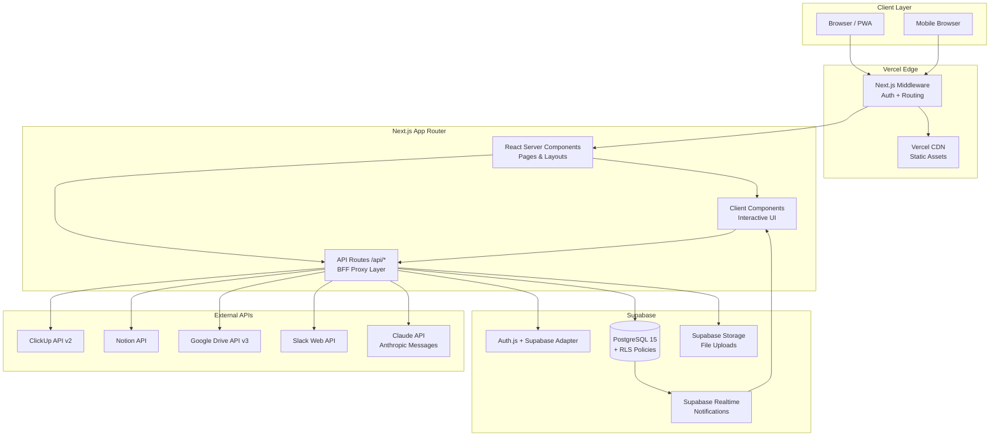
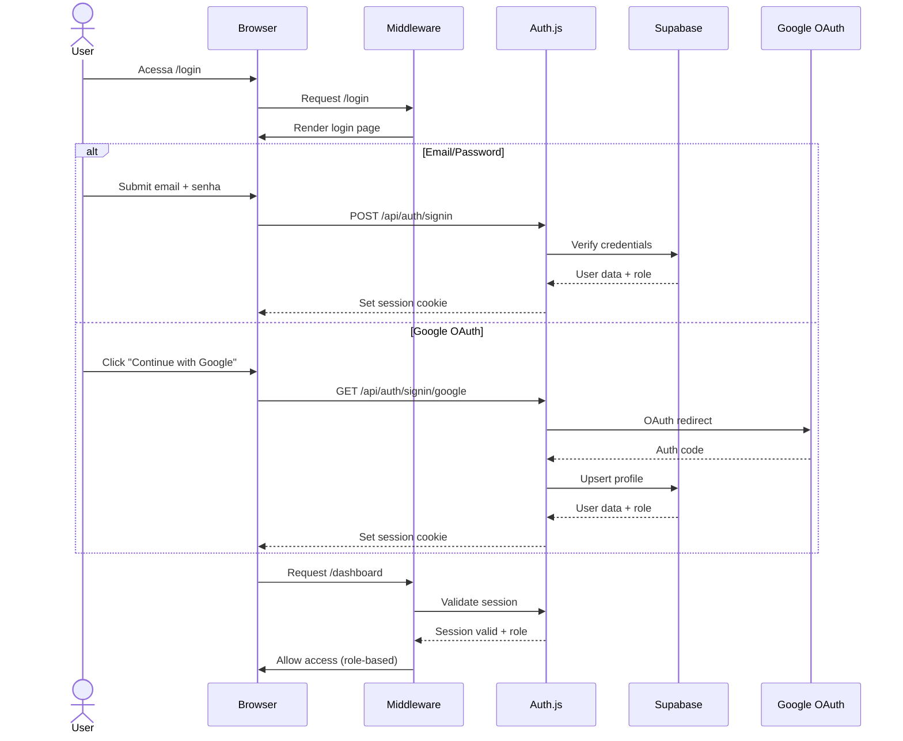
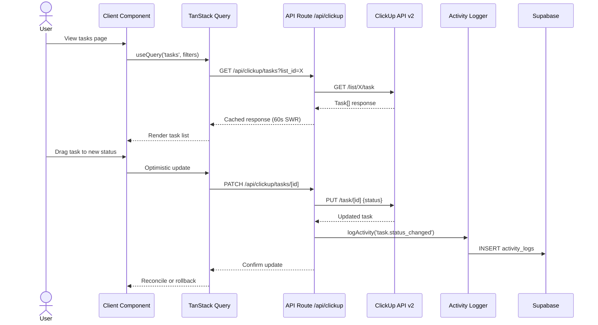

# Jubileu OS — Fullstack Architecture Document

**Version:** 1.0.0
**Date:** 2026-03-06
**Author:** Orion (AIOS Master / Architect)
**PRD Reference:** `docs/prd-sistema-operacional.md`
**Status:** Draft

---

## Introduction

Este documento define a arquitetura técnica completa do Jubileu OS — o sistema operacional web da agência Jubileu. Serve como source of truth para todo o desenvolvimento, guiando AI agents e developers na implementação consistente.

O sistema é um **Serverless Monolith** usando Next.js 15 App Router, com Supabase como backend-as-a-service e Vercel como plataforma de deploy. Integra APIs externas (ClickUp, Notion, Google Drive, Slack, Claude) via API Routes que atuam como BFF (Backend For Frontend).

### Starter Template

N/A — Projeto greenfield. Será inicializado com `create-next-app@latest` usando App Router, TypeScript e Tailwind CSS.

### Change Log

| Date | Version | Description | Author |
|------|---------|-------------|--------|
| 2026-03-06 | 1.0.0 | Arquitetura inicial completa | Orion |

---

## High Level Architecture

### Technical Summary

O Jubileu OS é um **Serverless Monolith** deployado na Vercel, onde Next.js 15 App Router serve tanto o frontend (React Server Components + Client Components) quanto o backend (API Routes como BFF proxy). O Supabase fornece PostgreSQL com Row-Level Security para isolamento de dados por role/client, autenticação via Auth.js v5 com Supabase Adapter, storage para uploads, e Realtime para notificações. Todas as integrações externas (ClickUp, Notion, Google Drive, Slack) são proxied via API Routes, garantindo que tokens nunca são expostos ao client. A arquitetura é otimizada para desenvolvimento rápido com agentes IA, mantendo extensibilidade para as 3 fases do roadmap.

### Platform and Infrastructure

**Platform:** Vercel + Supabase
**Key Services:**
- Vercel: Hosting, Edge Functions, Image Optimization, Analytics, Speed Insights, Preview Deployments
- Supabase: PostgreSQL 15, Auth (via Auth.js adapter), Storage, Realtime, Row-Level Security
- Vercel KV (opcional): Cache de respostas de APIs externas

**Deployment Regions:** Vercel auto (GRU — São Paulo para menor latência Brasil)

### Repository Structure

**Structure:** Single Next.js project (não monorepo)
**Rationale:** Com Next.js App Router, frontend e backend coexistem no mesmo projeto. Monorepo tools (Turborepo, Nx) adicionam complexidade desnecessária nesta fase. Se futuramente surgir necessidade de pacotes compartilhados, migrar para monorepo é straightforward.

### High Level Architecture Diagram



### Architectural Patterns

- **Serverless Monolith:** Next.js App Router unifica frontend e backend em um deploy. API Routes são serverless functions na Vercel. — _Rationale:_ Simplicidade operacional, zero infra para gerenciar, scale automático.

- **BFF (Backend For Frontend):** API Routes atuam como proxy autenticado para todas as APIs externas. — _Rationale:_ Tokens nunca expostos ao client, permite cache/transform server-side, single point of auth.

- **Component-Based UI (shadcn/ui):** Componentes copiados para o projeto, não instalados como dependência. — _Rationale:_ Controle total sobre customização, zero breaking changes de updates, tree-shaking nativo.

- **Server-First Rendering:** React Server Components como padrão, Client Components apenas quando necessário (interatividade, estado). — _Rationale:_ Menor bundle JS, melhor performance, dados carregados server-side.

- **Row-Level Security (RLS):** Supabase RLS policies enforçam isolamento de dados por role e client_id. — _Rationale:_ Segurança a nível de banco — mesmo que API tenha bug, dados vazam só do escopo autorizado.

- **Optimistic Updates:** Ações do usuário refletem imediatamente na UI, com rollback se API falhar. — _Rationale:_ UX responsiva, especialmente importante em mobile com conexão instável.

---

## Tech Stack

| Category | Technology | Version | Purpose | Rationale |
|----------|-----------|---------|---------|-----------|
| Language | TypeScript | 5.x (strict) | Frontend + Backend | Type safety full-stack, melhor DX com autocomplete |
| Framework | Next.js (App Router) | 15.x | Fullstack framework | RSC, API Routes, SSR/SSG, Image Optimization, Middleware |
| UI Components | shadcn/ui | latest | Component library | Customizável, acessível, Tailwind-native, não é dependência |
| Styling | Tailwind CSS | 4.x | Utility-first CSS | Consistência, responsive-first, dark mode nativo |
| State Management | Zustand | 5.x | Client state | API minimalista, zero boilerplate, persiste facilmente |
| Data Fetching | TanStack Query | 5.x | Server state | Cache, revalidation, optimistic updates, loading/error states |
| Forms | React Hook Form + Zod | latest | Form handling + validation | Performance (uncontrolled), type-safe schemas |
| Database | Supabase (PostgreSQL 15) | latest | Persistent storage | RLS, Realtime, Auth adapter, Storage, free tier generoso |
| Auth | Auth.js v5 | 5.x | Authentication | Multi-provider, Supabase adapter, session management |
| Icons | Lucide React | latest | Icon system | Consistente com shadcn/ui, tree-shakeable |
| Drag & Drop | @dnd-kit | latest | Kanban interactions | Acessível, performante, framework-agnostic |
| Rich Text Editor | Tiptap | 2.x | Notion-like editing | Extensível, collaborative-ready, ProseMirror-based |
| Testing (Unit) | Vitest | latest | Unit tests | Compatível com Vite/Next.js, rápido, ESM native |
| Testing (Component) | Testing Library | latest | Component tests | Testa comportamento não implementação |
| Testing (E2E) | Playwright | latest | End-to-end tests | Multi-browser, auto-wait, Vercel integration |
| Package Manager | pnpm | 9.x | Dependency management | Rápido, disk-efficient, strict por padrão |
| Linting | ESLint + Prettier | latest | Code quality | Consistência, catch bugs early |
| CI/CD | Vercel | — | Deploy automation | Zero config, preview per branch, instant rollback |
| Monitoring | Vercel Analytics + Speed Insights | — | Performance monitoring | Free tier, Core Web Vitals, real user data |

---

## Data Models

### Profile

**Purpose:** Representa um usuário da plataforma com seu role e metadados.

```typescript
interface Profile {
  id: string;              // UUID, FK to auth.users
  email: string;
  full_name: string;
  avatar_url: string | null;
  role: 'admin' | 'member' | 'client';
  is_active: boolean;
  last_login_at: string | null;
  created_at: string;
  updated_at: string;
}
```

**Relationships:**
- Has many `UserClient` (N:N with Client via join table)
- Has many `ActivityLog`
- Has many `ChatSession`

### Client

**Purpose:** Representa um cliente da agência (Pelicula, Levee, Caracol, etc).

```typescript
interface Client {
  id: string;              // UUID
  name: string;
  slug: string;            // URL-friendly identifier
  logo_url: string | null;
  contacts: ContactInfo[]; // JSONB
  links: Record<string, string>; // JSONB (website, instagram, etc)
  clickup_tag: string | null;    // Tag name usada no ClickUp
  notion_root_page_id: string | null;  // Root page no Notion
  is_active: boolean;
  created_at: string;
  updated_at: string;
}

interface ContactInfo {
  name: string;
  role: string;
  email?: string;
  phone?: string;
}
```

**Relationships:**
- Has many `UserClient` (N:N with Profile)
- Referenced by `ActivityLog.client_id`

### UserClient (Join Table)

**Purpose:** Associação N:N entre usuários e clientes.

```typescript
interface UserClient {
  user_id: string;   // FK to profiles.id
  client_id: string; // FK to clients.id
  created_at: string;
}
```

### ActivityLog

**Purpose:** Registro automático de toda atividade na plataforma.

```typescript
interface ActivityLog {
  id: string;              // UUID
  user_id: string;         // FK to profiles.id
  action: ActivityAction;
  entity_type: 'task' | 'document' | 'client' | 'workflow' | 'agent' | 'system';
  entity_id: string | null;
  entity_name: string | null;
  client_id: string | null; // FK to clients.id (se ação relacionada a cliente)
  metadata: Record<string, any>; // JSONB — detalhes extras
  created_at: string;
}

type ActivityAction =
  | 'task.created' | 'task.updated' | 'task.status_changed' | 'task.commented'
  | 'document.viewed' | 'document.created' | 'document.edited'
  | 'client.created' | 'client.updated'
  | 'workflow.started' | 'workflow.step_completed' | 'workflow.completed'
  | 'agent.chat_started' | 'agent.chat_message'
  | 'system.login' | 'system.logout';
```

### ChatSession

**Purpose:** Sessão de conversa com agente IA.

```typescript
interface ChatSession {
  id: string;              // UUID
  user_id: string;         // FK to profiles.id
  agent_id: string;        // Identifier do agente AIOS
  title: string;
  messages: ChatMessage[]; // JSONB array
  context_refs: ContextRef[]; // JSONB — links para tasks/docs anexados
  created_at: string;
  updated_at: string;
}

interface ChatMessage {
  role: 'user' | 'assistant';
  content: string;
  timestamp: string;
}

interface ContextRef {
  type: 'clickup_task' | 'notion_page';
  id: string;
  title: string;
}
```

### InviteToken

**Purpose:** Tokens de convite para novos usuários.

```typescript
interface InviteToken {
  id: string;           // UUID
  email: string;
  role: 'admin' | 'member' | 'client';
  client_ids: string[]; // Clientes associados ao convite
  created_by: string;   // FK to profiles.id
  expires_at: string;
  used_at: string | null;
  created_at: string;
}
```

---

## Database Schema

```sql
-- Enum for user roles
CREATE TYPE user_role AS ENUM ('admin', 'member', 'client');

-- Profiles (extends auth.users)
CREATE TABLE profiles (
  id UUID PRIMARY KEY REFERENCES auth.users(id) ON DELETE CASCADE,
  email TEXT NOT NULL,
  full_name TEXT NOT NULL,
  avatar_url TEXT,
  role user_role NOT NULL DEFAULT 'member',
  is_active BOOLEAN NOT NULL DEFAULT true,
  last_login_at TIMESTAMPTZ,
  created_at TIMESTAMPTZ NOT NULL DEFAULT now(),
  updated_at TIMESTAMPTZ NOT NULL DEFAULT now()
);

-- Clients
CREATE TABLE clients (
  id UUID PRIMARY KEY DEFAULT gen_random_uuid(),
  name TEXT NOT NULL,
  slug TEXT NOT NULL UNIQUE,
  logo_url TEXT,
  contacts JSONB NOT NULL DEFAULT '[]',
  links JSONB NOT NULL DEFAULT '{}',
  clickup_tag TEXT,
  notion_root_page_id TEXT,
  is_active BOOLEAN NOT NULL DEFAULT true,
  created_at TIMESTAMPTZ NOT NULL DEFAULT now(),
  updated_at TIMESTAMPTZ NOT NULL DEFAULT now()
);

-- User-Client association (N:N)
CREATE TABLE user_clients (
  user_id UUID NOT NULL REFERENCES profiles(id) ON DELETE CASCADE,
  client_id UUID NOT NULL REFERENCES clients(id) ON DELETE CASCADE,
  created_at TIMESTAMPTZ NOT NULL DEFAULT now(),
  PRIMARY KEY (user_id, client_id)
);

-- Activity logs
CREATE TABLE activity_logs (
  id UUID PRIMARY KEY DEFAULT gen_random_uuid(),
  user_id UUID NOT NULL REFERENCES profiles(id),
  action TEXT NOT NULL,
  entity_type TEXT NOT NULL,
  entity_id TEXT,
  entity_name TEXT,
  client_id UUID REFERENCES clients(id),
  metadata JSONB NOT NULL DEFAULT '{}',
  created_at TIMESTAMPTZ NOT NULL DEFAULT now()
);

-- Chat sessions with AI agents
CREATE TABLE chat_sessions (
  id UUID PRIMARY KEY DEFAULT gen_random_uuid(),
  user_id UUID NOT NULL REFERENCES profiles(id) ON DELETE CASCADE,
  agent_id TEXT NOT NULL,
  title TEXT NOT NULL,
  messages JSONB NOT NULL DEFAULT '[]',
  context_refs JSONB NOT NULL DEFAULT '[]',
  created_at TIMESTAMPTZ NOT NULL DEFAULT now(),
  updated_at TIMESTAMPTZ NOT NULL DEFAULT now()
);

-- Invite tokens
CREATE TABLE invite_tokens (
  id UUID PRIMARY KEY DEFAULT gen_random_uuid(),
  email TEXT NOT NULL,
  role user_role NOT NULL DEFAULT 'member',
  client_ids UUID[] NOT NULL DEFAULT '{}',
  created_by UUID NOT NULL REFERENCES profiles(id),
  expires_at TIMESTAMPTZ NOT NULL,
  used_at TIMESTAMPTZ,
  created_at TIMESTAMPTZ NOT NULL DEFAULT now()
);

-- Indexes
CREATE INDEX idx_activity_logs_user ON activity_logs(user_id, created_at DESC);
CREATE INDEX idx_activity_logs_client ON activity_logs(client_id, created_at DESC);
CREATE INDEX idx_activity_logs_entity ON activity_logs(entity_type, entity_id);
CREATE INDEX idx_chat_sessions_user ON chat_sessions(user_id, updated_at DESC);
CREATE INDEX idx_invite_tokens_email ON invite_tokens(email) WHERE used_at IS NULL;
CREATE INDEX idx_profiles_role ON profiles(role) WHERE is_active = true;

-- Updated_at trigger
CREATE OR REPLACE FUNCTION update_updated_at()
RETURNS TRIGGER AS $$
BEGIN
  NEW.updated_at = now();
  RETURN NEW;
END;
$$ LANGUAGE plpgsql;

CREATE TRIGGER profiles_updated_at BEFORE UPDATE ON profiles
  FOR EACH ROW EXECUTE FUNCTION update_updated_at();
CREATE TRIGGER clients_updated_at BEFORE UPDATE ON clients
  FOR EACH ROW EXECUTE FUNCTION update_updated_at();
CREATE TRIGGER chat_sessions_updated_at BEFORE UPDATE ON chat_sessions
  FOR EACH ROW EXECUTE FUNCTION update_updated_at();

-- Row Level Security
ALTER TABLE profiles ENABLE ROW LEVEL SECURITY;
ALTER TABLE clients ENABLE ROW LEVEL SECURITY;
ALTER TABLE user_clients ENABLE ROW LEVEL SECURITY;
ALTER TABLE activity_logs ENABLE ROW LEVEL SECURITY;
ALTER TABLE chat_sessions ENABLE ROW LEVEL SECURITY;
ALTER TABLE invite_tokens ENABLE ROW LEVEL SECURITY;

-- RLS Policies: Profiles
CREATE POLICY "Users can view own profile"
  ON profiles FOR SELECT
  USING (auth.uid() = id);

CREATE POLICY "Admins can view all profiles"
  ON profiles FOR SELECT
  USING (
    EXISTS (SELECT 1 FROM profiles WHERE id = auth.uid() AND role = 'admin')
  );

CREATE POLICY "Admins can update any profile"
  ON profiles FOR UPDATE
  USING (
    EXISTS (SELECT 1 FROM profiles WHERE id = auth.uid() AND role = 'admin')
  );

CREATE POLICY "Users can update own profile"
  ON profiles FOR UPDATE
  USING (auth.uid() = id)
  WITH CHECK (auth.uid() = id AND role = (SELECT role FROM profiles WHERE id = auth.uid()));

-- RLS Policies: Clients
CREATE POLICY "Admins and members can view all active clients"
  ON clients FOR SELECT
  USING (
    is_active = true AND
    EXISTS (SELECT 1 FROM profiles WHERE id = auth.uid() AND role IN ('admin', 'member'))
  );

CREATE POLICY "Client users see only their clients"
  ON clients FOR SELECT
  USING (
    is_active = true AND
    EXISTS (
      SELECT 1 FROM user_clients uc
      JOIN profiles p ON p.id = uc.user_id
      WHERE uc.user_id = auth.uid() AND uc.client_id = clients.id AND p.role = 'client'
    )
  );

CREATE POLICY "Admins can manage clients"
  ON clients FOR ALL
  USING (
    EXISTS (SELECT 1 FROM profiles WHERE id = auth.uid() AND role = 'admin')
  );

-- RLS Policies: Activity Logs
CREATE POLICY "Users see own activity"
  ON activity_logs FOR SELECT
  USING (user_id = auth.uid());

CREATE POLICY "Admins see all activity"
  ON activity_logs FOR SELECT
  USING (
    EXISTS (SELECT 1 FROM profiles WHERE id = auth.uid() AND role = 'admin')
  );

CREATE POLICY "Members see activity of their clients"
  ON activity_logs FOR SELECT
  USING (
    EXISTS (SELECT 1 FROM profiles WHERE id = auth.uid() AND role = 'member')
    AND (
      client_id IS NULL
      OR EXISTS (SELECT 1 FROM user_clients WHERE user_id = auth.uid() AND client_id = activity_logs.client_id)
    )
  );

CREATE POLICY "Authenticated users can insert activity"
  ON activity_logs FOR INSERT
  WITH CHECK (auth.uid() = user_id);

-- RLS Policies: Chat Sessions
CREATE POLICY "Users manage own chat sessions"
  ON chat_sessions FOR ALL
  USING (user_id = auth.uid());

-- RLS Policies: Invite Tokens
CREATE POLICY "Admins manage invites"
  ON invite_tokens FOR ALL
  USING (
    EXISTS (SELECT 1 FROM profiles WHERE id = auth.uid() AND role = 'admin')
  );
```

---

## API Specification

### API Routes Structure (BFF Pattern)

Todas as API Routes vivem em `app/api/` e seguem o padrão:

```
app/api/
├── auth/                    # Auth.js handlers
│   └── [...nextauth]/
│       └── route.ts
├── clickup/                 # ClickUp proxy
│   ├── tasks/
│   │   ├── route.ts        # GET (list) + POST (create)
│   │   └── [taskId]/
│   │       ├── route.ts    # GET (detail) + PATCH (update)
│   │       └── comments/
│   │           └── route.ts # GET + POST
│   ├── lists/
│   │   └── route.ts        # GET
│   └── spaces/
│       └── route.ts        # GET
├── notion/                  # Notion proxy
│   ├── search/
│   │   └── route.ts        # POST (search pages)
│   ├── pages/
│   │   ├── route.ts        # POST (create page)
│   │   └── [pageId]/
│   │       ├── route.ts    # GET (page content) + PATCH (update)
│   │       └── blocks/
│   │           └── route.ts # GET (page blocks)
│   └── databases/
│       └── [dbId]/
│           └── route.ts    # POST (query database)
├── clients/                 # Client CRUD (Supabase)
│   ├── route.ts            # GET (list) + POST (create)
│   └── [slug]/
│       └── route.ts        # GET + PATCH + DELETE
├── users/                   # User management (Supabase)
│   ├── route.ts            # GET (list) + POST (invite)
│   └── [userId]/
│       └── route.ts        # GET + PATCH
├── activity/                # Activity logs
│   └── route.ts            # GET (feed)
├── agents/                  # AI agent chat
│   └── chat/
│       └── route.ts        # POST (streaming response)
├── drive/                   # Google Drive proxy (Phase 3)
│   ├── files/
│   │   └── route.ts
│   └── folders/
│       └── route.ts
└── slack/                   # Slack proxy (Phase 3)
    ├── channels/
    │   └── route.ts
    └── messages/
        └── route.ts
```

### API Route Pattern

Todas as API routes seguem este padrão:

```typescript
// app/api/clickup/tasks/route.ts
import { NextRequest, NextResponse } from 'next/server';
import { auth } from '@/lib/auth';
import { clickupClient } from '@/lib/clickup/client';
import { logActivity } from '@/lib/activity';

export async function GET(request: NextRequest) {
  const session = await auth();
  if (!session?.user) {
    return NextResponse.json({ error: 'Unauthorized' }, { status: 401 });
  }

  const { searchParams } = new URL(request.url);
  const listId = searchParams.get('list_id');

  try {
    const tasks = await clickupClient.getTasks({ listId });
    return NextResponse.json(tasks);
  } catch (error) {
    console.error('ClickUp API error:', error);
    return NextResponse.json(
      { error: 'Failed to fetch tasks' },
      { status: 502 }
    );
  }
}

export async function POST(request: NextRequest) {
  const session = await auth();
  if (!session?.user) {
    return NextResponse.json({ error: 'Unauthorized' }, { status: 401 });
  }

  const body = await request.json();
  // Zod validation here

  try {
    const task = await clickupClient.createTask(body);
    await logActivity({
      userId: session.user.id,
      action: 'task.created',
      entityType: 'task',
      entityId: task.id,
      entityName: task.name,
    });
    return NextResponse.json(task, { status: 201 });
  } catch (error) {
    console.error('ClickUp API error:', error);
    return NextResponse.json(
      { error: 'Failed to create task' },
      { status: 502 }
    );
  }
}
```

---

## External APIs

### ClickUp API v2

- **Purpose:** Gestão de tarefas, listas, comentários
- **Documentation:** https://clickup.com/api/
- **Base URL:** `https://api.clickup.com/api/v2`
- **Authentication:** Personal API Token via `Authorization` header
- **Rate Limits:** 100 requests/min per token

**Key Endpoints Used:**
- `GET /team/{team_id}/space` — Listar spaces
- `GET /space/{space_id}/folder` — Listar folders
- `GET /folder/{folder_id}/list` — Listar lists
- `GET /list/{list_id}/task` — Listar tasks
- `GET /task/{task_id}` — Detalhes da task
- `POST /list/{list_id}/task` — Criar task
- `PUT /task/{task_id}` — Atualizar task
- `GET /task/{task_id}/comment` — Listar comentários
- `POST /task/{task_id}/comment` — Adicionar comentário

**Integration Notes:** Token armazenado em `CLICKUP_API_TOKEN` env var. Workspace ID: `90133059528`. Rate limit gerenciado com retry + exponential backoff.

### Notion API

- **Purpose:** Base de conhecimento, documentação, skills, roteiros
- **Documentation:** https://developers.notion.com/
- **Base URL:** `https://api.notion.com/v1`
- **Authentication:** Internal Integration Token via `Authorization: Bearer` + `Notion-Version: 2022-06-28`
- **Rate Limits:** 3 requests/sec average

**Key Endpoints Used:**
- `POST /search` — Buscar páginas
- `GET /pages/{page_id}` — Obter página
- `GET /blocks/{block_id}/children` — Obter blocos de uma página
- `PATCH /blocks/{block_id}` — Atualizar bloco
- `POST /pages` — Criar página
- `POST /databases/{database_id}/query` — Query database

**Integration Notes:** Notion blocks precisam ser convertidos para React components no frontend. Mapeamento de block types em `lib/notion/block-renderer.tsx`.

### Google Drive API v3 (Phase 3)

- **Purpose:** Navegação e gestão de arquivos
- **Documentation:** https://developers.google.com/drive/api/v3/reference
- **Base URL:** `https://www.googleapis.com/drive/v3`
- **Authentication:** OAuth 2.0 Service Account
- **Rate Limits:** 1000 queries/100sec per user

### Slack Web API (Phase 3)

- **Purpose:** Comunicação integrada
- **Documentation:** https://api.slack.com/methods
- **Base URL:** `https://slack.com/api`
- **Authentication:** Bot Token (`xoxb-`)
- **Rate Limits:** Varies by method (1-20 req/min)

### Claude API (Phase 2)

- **Purpose:** Chat com agentes IA
- **Documentation:** https://docs.anthropic.com/
- **Base URL:** `https://api.anthropic.com/v1`
- **Authentication:** API Key via `x-api-key` header
- **Rate Limits:** Based on tier

**Key Endpoints Used:**
- `POST /messages` — Create message (com streaming)

**Integration Notes:** System prompt carregado dinamicamente baseado no agente selecionado. Streaming via Server-Sent Events na API route.

---

## Core Workflows

### Auth Flow



### Task Management Flow



---

## Frontend Architecture

### Component Architecture

```
components/
├── ui/                      # shadcn/ui base components (generated)
│   ├── button.tsx
│   ├── card.tsx
│   ├── dialog.tsx
│   ├── dropdown-menu.tsx
│   ├── input.tsx
│   ├── select.tsx
│   ├── sheet.tsx           # Slide-over panels
│   ├── skeleton.tsx
│   ├── toast.tsx
│   └── ...
├── layout/                  # App shell components
│   ├── app-shell.tsx       # Main layout wrapper
│   ├── sidebar.tsx         # Collapsible sidebar
│   ├── sidebar-nav.tsx     # Navigation items
│   ├── header.tsx          # Top header bar
│   ├── breadcrumbs.tsx     # Dynamic breadcrumbs
│   ├── client-selector.tsx # Global client filter
│   └── mobile-drawer.tsx   # Mobile navigation
├── features/                # Feature-specific components
│   ├── auth/
│   │   ├── login-form.tsx
│   │   ├── user-menu.tsx
│   │   └── invite-form.tsx
│   ├── tasks/
│   │   ├── task-list.tsx
│   │   ├── task-card.tsx
│   │   ├── task-kanban.tsx
│   │   ├── task-detail-panel.tsx
│   │   ├── task-create-dialog.tsx
│   │   ├── task-filters.tsx
│   │   └── task-comments.tsx
│   ├── clients/
│   │   ├── client-grid.tsx
│   │   ├── client-card.tsx
│   │   ├── client-dashboard.tsx
│   │   ├── client-form.tsx
│   │   └── client-info.tsx
│   ├── docs/
│   │   ├── page-browser.tsx
│   │   ├── page-viewer.tsx
│   │   ├── page-editor.tsx
│   │   ├── block-renderer.tsx
│   │   └── category-sidebar.tsx
│   ├── agents/              # Phase 2
│   │   ├── agent-grid.tsx
│   │   ├── agent-card.tsx
│   │   └── chat-interface.tsx
│   └── dashboard/
│       ├── widget-grid.tsx
│       ├── urgent-tasks-widget.tsx
│       ├── activity-widget.tsx
│       └── calendar-widget.tsx
└── shared/                  # Cross-feature shared components
    ├── command-palette.tsx  # Cmd+K global search
    ├── empty-state.tsx
    ├── loading-skeleton.tsx
    ├── error-boundary.tsx
    └── confirm-dialog.tsx
```

### State Management

```typescript
// stores/app-store.ts
import { create } from 'zustand';
import { persist } from 'zustand/middleware';

interface AppState {
  // Sidebar
  sidebarOpen: boolean;
  toggleSidebar: () => void;

  // Client filter
  activeClientId: string | null; // null = "Todos"
  setActiveClient: (id: string | null) => void;

  // View preferences
  taskViewMode: 'list' | 'kanban';
  setTaskViewMode: (mode: 'list' | 'kanban') => void;

  // Theme
  theme: 'light' | 'dark';
  setTheme: (theme: 'light' | 'dark') => void;
}

export const useAppStore = create<AppState>()(
  persist(
    (set) => ({
      sidebarOpen: true,
      toggleSidebar: () => set((s) => ({ sidebarOpen: !s.sidebarOpen })),

      activeClientId: null,
      setActiveClient: (id) => set({ activeClientId: id }),

      taskViewMode: 'kanban',
      setTaskViewMode: (mode) => set({ taskViewMode: mode }),

      theme: 'dark',
      setTheme: (theme) => set({ theme }),
    }),
    { name: 'jubileu-os-prefs' }
  )
);
```

**State Management Patterns:**
- Zustand para estado global da UI (sidebar, filtros, preferências)
- TanStack Query para server state (dados de APIs — tasks, docs, clients)
- React `useState`/`useReducer` para estado local de componentes
- URL search params para filtros compartilháveis (via `nuqs` ou manual)

### Routing Architecture

```
app/
├── (auth)/                  # Auth group (no layout)
│   ├── login/
│   │   └── page.tsx
│   └── invite/
│       └── [token]/
│           └── page.tsx
├── (dashboard)/             # Authenticated group
│   ├── layout.tsx           # App shell (sidebar + header)
│   ├── dashboard/
│   │   └── page.tsx         # Home dashboard
│   ├── tasks/
│   │   └── page.tsx         # Task list + kanban
│   ├── clients/
│   │   ├── page.tsx         # Client grid
│   │   └── [slug]/
│   │       └── page.tsx     # Client dashboard
│   ├── docs/
│   │   ├── page.tsx         # Notion browser
│   │   └── [pageId]/
│   │       └── page.tsx     # Page viewer/editor
│   ├── agents/              # Phase 2
│   │   ├── page.tsx         # Agent directory
│   │   └── [id]/
│   │       └── chat/
│   │           └── page.tsx
│   ├── workflows/           # Phase 2
│   │   └── page.tsx
│   ├── settings/
│   │   ├── page.tsx         # General settings
│   │   └── users/
│   │       └── page.tsx     # User management (admin)
│   └── inbox/               # Phase 3
│       └── page.tsx
├── (portal)/                # Client portal group
│   ├── layout.tsx           # Simplified layout
│   └── portal/
│       ├── page.tsx         # Client home
│       ├── tasks/
│       │   └── page.tsx
│       └── docs/
│           └── page.tsx
├── api/                     # API Routes (see API Spec)
├── layout.tsx               # Root layout (providers)
├── not-found.tsx
└── error.tsx
```

### Protected Route Pattern (Middleware)

```typescript
// middleware.ts
import { auth } from '@/lib/auth';
import { NextResponse } from 'next/server';
import type { NextRequest } from 'next/server';

export async function middleware(request: NextRequest) {
  const session = await auth();
  const { pathname } = request.nextUrl;

  // Public routes
  if (pathname.startsWith('/login') || pathname.startsWith('/invite')) {
    if (session) {
      return NextResponse.redirect(new URL('/dashboard', request.url));
    }
    return NextResponse.next();
  }

  // All other routes require auth
  if (!session) {
    return NextResponse.redirect(new URL('/login', request.url));
  }

  // Role-based routing
  const role = session.user.role;

  // Client users → portal only
  if (role === 'client' && pathname.startsWith('/dashboard')) {
    return NextResponse.redirect(new URL('/portal', request.url));
  }

  // Non-clients can't access portal
  if (role !== 'client' && pathname.startsWith('/portal')) {
    return NextResponse.redirect(new URL('/dashboard', request.url));
  }

  // Admin-only routes
  if (pathname.startsWith('/dashboard/settings/users') && role !== 'admin') {
    return NextResponse.redirect(new URL('/dashboard', request.url));
  }

  return NextResponse.next();
}

export const config = {
  matcher: ['/((?!api|_next/static|_next/image|favicon.ico|manifest.json).*)'],
};
```

### Frontend Services Layer (API Client)

```typescript
// lib/api/client.ts
const BASE_URL = '/api';

class ApiClient {
  private async request<T>(path: string, options?: RequestInit): Promise<T> {
    const response = await fetch(`${BASE_URL}${path}`, {
      ...options,
      headers: {
        'Content-Type': 'application/json',
        ...options?.headers,
      },
    });

    if (!response.ok) {
      const error = await response.json().catch(() => ({}));
      throw new ApiError(response.status, error.error || 'Request failed');
    }

    return response.json();
  }

  // ClickUp
  async getTasks(params: TaskQueryParams) {
    const qs = new URLSearchParams(params as any).toString();
    return this.request<ClickUpTask[]>(`/clickup/tasks?${qs}`);
  }

  async getTask(taskId: string) {
    return this.request<ClickUpTask>(`/clickup/tasks/${taskId}`);
  }

  async createTask(data: CreateTaskInput) {
    return this.request<ClickUpTask>('/clickup/tasks', {
      method: 'POST',
      body: JSON.stringify(data),
    });
  }

  // Notion
  async searchPages(query: string) {
    return this.request<NotionPage[]>('/notion/search', {
      method: 'POST',
      body: JSON.stringify({ query }),
    });
  }

  // Clients (Supabase direct via API route)
  async getClients() {
    return this.request<Client[]>('/clients');
  }

  async createClient(data: CreateClientInput) {
    return this.request<Client>('/clients', {
      method: 'POST',
      body: JSON.stringify(data),
    });
  }
}

export const api = new ApiClient();
```

---

## Unified Project Structure

```
jubileu-os/
├── app/                         # Next.js App Router
│   ├── (auth)/                  # Public auth pages
│   ├── (dashboard)/             # Authenticated pages
│   ├── (portal)/                # Client portal
│   ├── api/                     # API Routes (BFF)
│   ├── layout.tsx               # Root layout + providers
│   ├── globals.css              # Tailwind imports
│   └── not-found.tsx
├── components/                  # React components
│   ├── ui/                      # shadcn/ui primitives
│   ├── layout/                  # App shell (sidebar, header)
│   ├── features/                # Feature modules
│   └── shared/                  # Cross-feature shared
├── lib/                         # Core libraries
│   ├── auth.ts                  # Auth.js config
│   ├── supabase/
│   │   ├── client.ts            # Browser client
│   │   ├── server.ts            # Server client
│   │   └── middleware.ts        # Middleware client
│   ├── clickup/
│   │   └── client.ts            # ClickUp API client
│   ├── notion/
│   │   ├── client.ts            # Notion API client
│   │   └── block-renderer.tsx   # Block → React mapping
│   ├── api/
│   │   └── client.ts            # Frontend API client
│   ├── activity.ts              # Activity logging helper
│   └── utils.ts                 # Shared utilities (cn, etc)
├── hooks/                       # Custom React hooks
│   ├── use-tasks.ts             # TanStack Query hooks for tasks
│   ├── use-clients.ts
│   ├── use-notion.ts
│   └── use-activity.ts
├── stores/                      # Zustand stores
│   └── app-store.ts
├── types/                       # TypeScript types
│   ├── database.ts              # Supabase generated types
│   ├── clickup.ts               # ClickUp API types
│   ├── notion.ts                # Notion API types
│   └── index.ts                 # Shared app types
├── supabase/                    # Supabase local dev
│   ├── migrations/              # SQL migrations
│   ├── seed.sql                 # Test data
│   └── config.toml
├── public/                      # Static assets
│   ├── manifest.json            # PWA manifest
│   ├── sw.js                    # Service worker
│   └── icons/                   # PWA icons
├── .env.example                 # Environment template
├── .env.local                   # Local env (gitignored)
├── next.config.ts               # Next.js config
├── tailwind.config.ts           # Tailwind config
├── tsconfig.json                # TypeScript config
├── vitest.config.ts             # Test config
├── playwright.config.ts         # E2E test config
├── components.json              # shadcn/ui config
├── package.json
├── pnpm-lock.yaml
└── README.md
```

---

## Development Workflow

### Prerequisites

```bash
node -v   # >= 20.x LTS
pnpm -v   # >= 9.x
```

### Initial Setup

```bash
# Clone and install
git clone <repo-url> jubileu-os
cd jubileu-os
pnpm install

# Setup environment
cp .env.example .env.local
# Fill in: SUPABASE_URL, SUPABASE_ANON_KEY, CLICKUP_API_TOKEN, etc

# Setup Supabase (local dev)
npx supabase start
npx supabase db push

# Seed test data
npx supabase db seed

# Start dev server
pnpm dev
```

### Development Commands

```bash
# Development
pnpm dev              # Start Next.js dev server (port 3000)
pnpm build            # Production build
pnpm start            # Start production server

# Database
pnpm db:push          # Push migrations to Supabase
pnpm db:seed          # Seed test data
pnpm db:reset         # Reset + re-seed
pnpm db:gen-types     # Generate TypeScript types from schema

# Testing
pnpm test             # Run Vitest unit/component tests
pnpm test:e2e         # Run Playwright E2E tests
pnpm test:coverage    # Run with coverage report

# Code quality
pnpm lint             # ESLint check
pnpm lint:fix         # ESLint auto-fix
pnpm typecheck        # TypeScript type check
pnpm format           # Prettier format
```

### Environment Variables

```bash
# .env.local

# Supabase
NEXT_PUBLIC_SUPABASE_URL=https://xxx.supabase.co
NEXT_PUBLIC_SUPABASE_ANON_KEY=eyJ...
SUPABASE_SERVICE_ROLE_KEY=eyJ...

# Auth.js
AUTH_SECRET=<random-32-char-string>
AUTH_GOOGLE_ID=<google-oauth-client-id>
AUTH_GOOGLE_SECRET=<google-oauth-client-secret>

# ClickUp
CLICKUP_API_TOKEN=pk_...

# Notion
NOTION_API_TOKEN=ntn_...

# Claude (Phase 2)
ANTHROPIC_API_KEY=sk-ant-...

# Google Drive (Phase 3)
GOOGLE_SERVICE_ACCOUNT_KEY=<base64-encoded-json>

# Slack (Phase 3)
SLACK_BOT_TOKEN=xoxb-...
```

---

## Deployment Architecture

### Strategy

**Frontend + Backend:** Deploy unificado via Vercel (Next.js auto-detected)
- **Build Command:** `pnpm build`
- **Output:** `.next/` (automatic)
- **CDN:** Vercel Edge Network (global, auto GRU for BR)
- **Serverless Functions:** API Routes deployed as Vercel Serverless Functions
- **Image Optimization:** Vercel Image Optimization (automatic)

### CI/CD Pipeline

Deploy automático via Vercel Git Integration:
- Push to `main` → Production deploy
- Push to any branch → Preview deploy with unique URL
- PR comments with preview link automático

### Environments

| Environment | URL | Purpose |
|-------------|-----|---------|
| Development | `http://localhost:3000` | Local development |
| Preview | `jubileu-os-*.vercel.app` | PR preview (auto per branch) |
| Production | `os.jubileu.com.br` (TBD) | Live environment |

---

## Security and Performance

### Security Requirements

**Frontend Security:**
- CSP Headers: Strict CSP via `next.config.ts` headers
- XSS Prevention: React auto-escaping + DOMPurify para rich text
- Secure Storage: Tokens somente em httpOnly cookies (Auth.js)

**Backend Security:**
- Input Validation: Zod schemas em todas as API routes
- Rate Limiting: `next-rate-limit` ou Vercel Edge rate limiting
- CORS Policy: Same-origin (API routes são same-domain)

**Authentication Security:**
- Token Storage: httpOnly secure cookies (Auth.js managed)
- Session Management: JWT sessions com refresh rotation
- Password Policy: Min 8 chars (delegado ao provider OAuth)

**Data Security:**
- RLS em todas as tabelas Supabase
- API tokens nunca expostos ao client (env vars server-side only)
- `SUPABASE_SERVICE_ROLE_KEY` usado apenas em API routes (server-side)

### Performance Optimization

**Frontend Performance:**
- Bundle Target: < 200KB initial JS (gzipped)
- Loading Strategy: RSC por padrão, lazy-load client components pesados
- Caching: TanStack Query SWR (60s tasks, 300s docs, 3600s clients)
- Images: Next.js Image Optimization com lazy loading

**Backend Performance:**
- Response Time Target: < 500ms P95 para API routes
- Database: Indexes em queries frequentes, connection pooling via Supabase
- External APIs: Cache responses (SWR pattern), batch requests quando possível
- Edge: Middleware roda na Edge (ultra-low latency para auth checks)

---

## Testing Strategy

### Testing Pyramid

```
         ╱  E2E (Playwright)  ╲        ← 5-10 critical flows
        ╱  Component (Testing Lib) ╲   ← Key UI components
       ╱   Unit (Vitest)            ╲  ← Business logic, utils, API helpers
```

### Coverage Targets

| Layer | Target | Focus |
|-------|--------|-------|
| Unit | 70% | `lib/`, `hooks/`, utils, API clients |
| Component | 50% | Feature components (forms, lists, panels) |
| E2E | Critical paths | Login, create task, navigate, client switch |

---

## Coding Standards

### Critical Rules

- **Server vs Client:** Use `'use client'` ONLY when component needs interactivity (useState, useEffect, event handlers). Default to Server Components.
- **API Calls:** Frontend NEVER calls external APIs directly. Always go through `/api/` routes.
- **Environment Variables:** `NEXT_PUBLIC_*` for client-accessible only. All API tokens are server-side only.
- **Error Handling:** All API routes wrapped in try/catch with structured error responses.
- **Type Safety:** No `any` types. Use Zod for runtime validation at API boundaries.
- **Imports:** Use `@/` path alias. Never relative imports above 2 levels (`../../` max).

### Naming Conventions

| Element | Convention | Example |
|---------|-----------|---------|
| Components | PascalCase | `TaskCard.tsx` |
| Hooks | camelCase with `use` | `useTasks.ts` |
| API Routes | kebab-case folders | `/api/clickup/tasks/` |
| Database Tables | snake_case | `activity_logs` |
| TypeScript Types | PascalCase | `ClickUpTask` |
| Zustand Stores | camelCase with `use` | `useAppStore.ts` |
| CSS Classes | Tailwind utilities | `className="flex items-center gap-2"` |
| Env Vars | SCREAMING_SNAKE | `CLICKUP_API_TOKEN` |

---

## Error Handling Strategy

### Error Response Format

```typescript
// Standard API error response
interface ApiErrorResponse {
  error: {
    code: string;         // Machine-readable: 'CLICKUP_RATE_LIMIT'
    message: string;      // Human-readable: 'ClickUp rate limit exceeded'
    status: number;       // HTTP status: 429
    details?: unknown;    // Optional extra context
  };
}
```

### Frontend Error Handling

```typescript
// hooks/use-api-error.ts
import { toast } from 'sonner';

export function handleApiError(error: unknown) {
  if (error instanceof ApiError) {
    switch (error.status) {
      case 401:
        // Redirect to login
        window.location.href = '/login';
        break;
      case 403:
        toast.error('Sem permissão para esta ação');
        break;
      case 429:
        toast.error('Muitas requisições. Tente novamente em alguns segundos.');
        break;
      case 502:
        toast.error('Serviço externo indisponível. Tente novamente.');
        break;
      default:
        toast.error(error.message || 'Erro inesperado');
    }
  } else {
    toast.error('Erro de conexão');
  }
}
```

### Backend Error Handling

```typescript
// lib/api/error-handler.ts
export function withErrorHandler(
  handler: (req: NextRequest) => Promise<NextResponse>
) {
  return async (req: NextRequest) => {
    try {
      return await handler(req);
    } catch (error) {
      console.error(`[API Error] ${req.method} ${req.url}:`, error);

      if (error instanceof ZodError) {
        return NextResponse.json(
          { error: { code: 'VALIDATION_ERROR', message: 'Invalid input', details: error.errors } },
          { status: 400 }
        );
      }

      return NextResponse.json(
        { error: { code: 'INTERNAL_ERROR', message: 'Internal server error' } },
        { status: 500 }
      );
    }
  };
}
```

---

## Monitoring and Observability

### Monitoring Stack

- **Frontend Monitoring:** Vercel Analytics (Core Web Vitals, page views, real user metrics)
- **Performance Monitoring:** Vercel Speed Insights (LCP, FID, CLS per page)
- **Error Tracking:** `console.error` + Vercel Function Logs (upgrade to Sentry if needed)
- **Uptime:** Vercel automatic health checks

### Key Metrics

**Frontend:**
- Core Web Vitals (LCP < 2.5s, FID < 100ms, CLS < 0.1)
- JavaScript errors por page
- API response times (P50, P95)

**Backend:**
- API Route invocation count and duration
- External API error rates (ClickUp, Notion timeouts)
- Database query performance (via Supabase dashboard)
