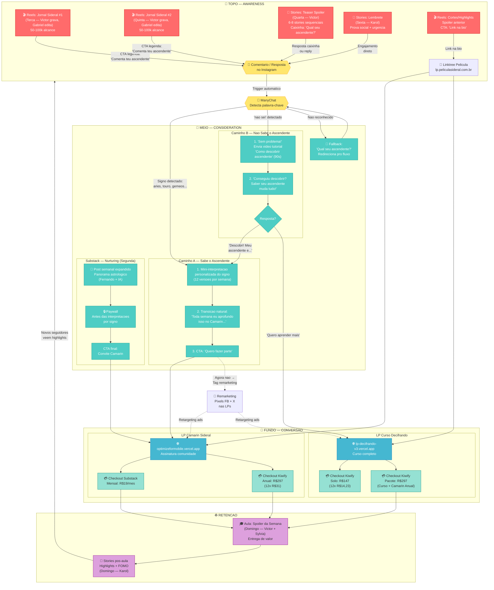
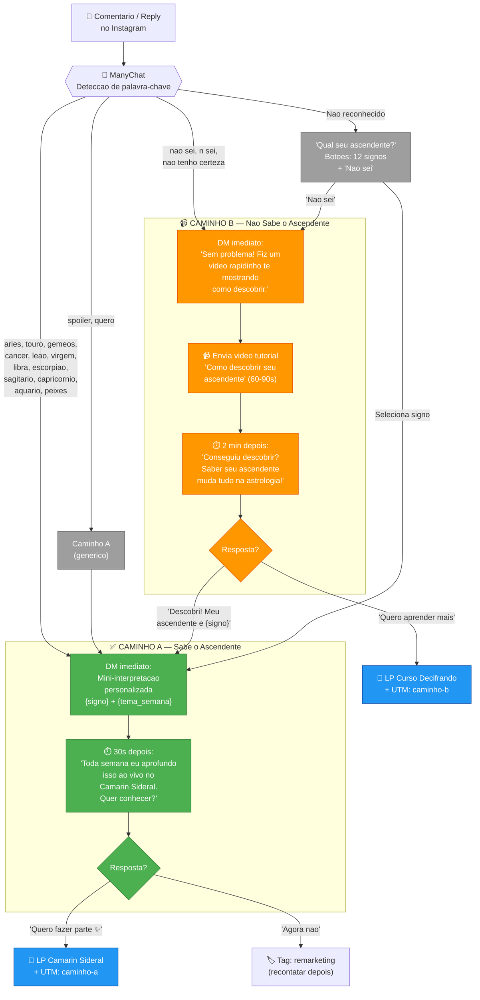
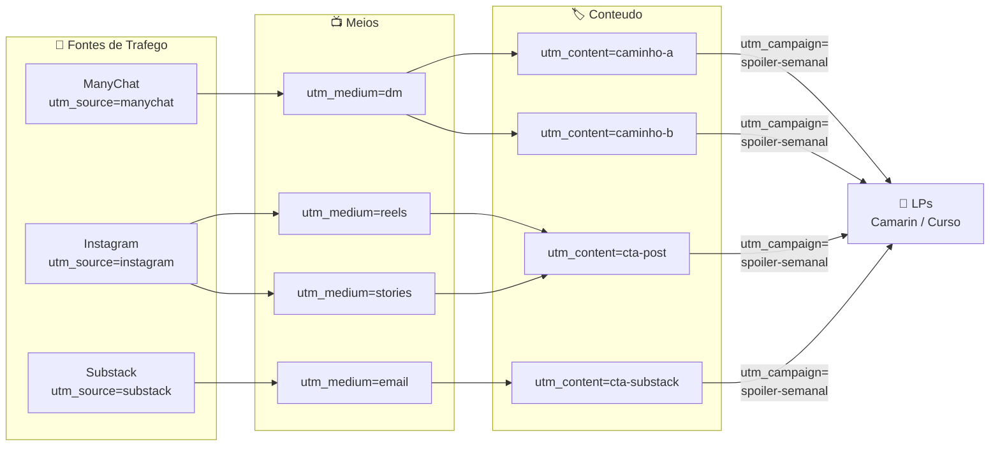

# Diagrama Visual — Funil Spoiler Astrologico da Semana

**Cliente:** Pelicula Sideral
**Criado:** 2026-02-24
**Referencia:** `docs/funil-spoiler-semanal.md`

---

## Funil Completo

---

## Fluxo ManyChat (Detalhe)

---

## Grade Semanal (Timeline)

```mermaid
gantt
    title Grade Semanal — Spoiler Astrologico
    dateFormat X
    axisFormat %s

    section Producao
    Briefing semana seguinte        :done, 0, 1
    Roteiros Reels + Stories        :active, 1, 2
    Gravacoes Victor                :1, 3
    Edicao Reel 1 (Gabriel)         :2, 3
    Edicao Reel 2 (Gabriel)         :3, 4
    Atualizar ManyChat              :1, 2
    Post Substack                   :1, 2
    Coleta metricas (Karol)         :1, 2

    section Publicacao
    SEG — Substack                  :crit, 1, 2
    TER — Reels Jornal #1          :crit, 2, 3
    QUA — Stories Teaser + Caixinha :crit, 3, 4
    QUI — Reels Jornal #2          :crit, 4, 5
    SEX — Stories Lembrete         :5, 6
    SAB — Ultimo CTA + Urgencia    :6, 7
    DOM — AULA SPOILER             :milestone, 7, 7

    section Pos-Aula
    Stories Highlights + FOMO       :7, 8
```

---

## UTM Tracking Map

---

## Legenda

| Cor | Significado |
|-----|-------------|
| 🔴 Vermelho | TOPO — Awareness (alcance organico) |
| 🟢 Verde | MEIO — Consideration (ManyChat + Substack) |
| 🔵 Azul | FUNDO — Conversao (LPs + Checkout) |
| 🟡 Amarelo | Triggers / Deteccao |
| 🟣 Roxo | Retencao / Pos-venda |
| ⬜ Cinza | Remarketing |

---

*Diagrama gerado para uso em Notion, GitHub, ou qualquer renderer Mermaid.*
*Referencia: `docs/funil-spoiler-semanal.md` + `docs/campanha-spoiler-semanal.md`*
